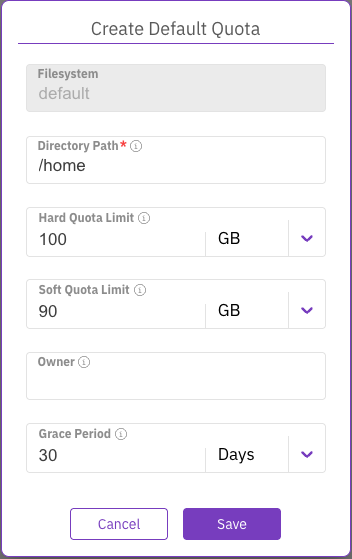
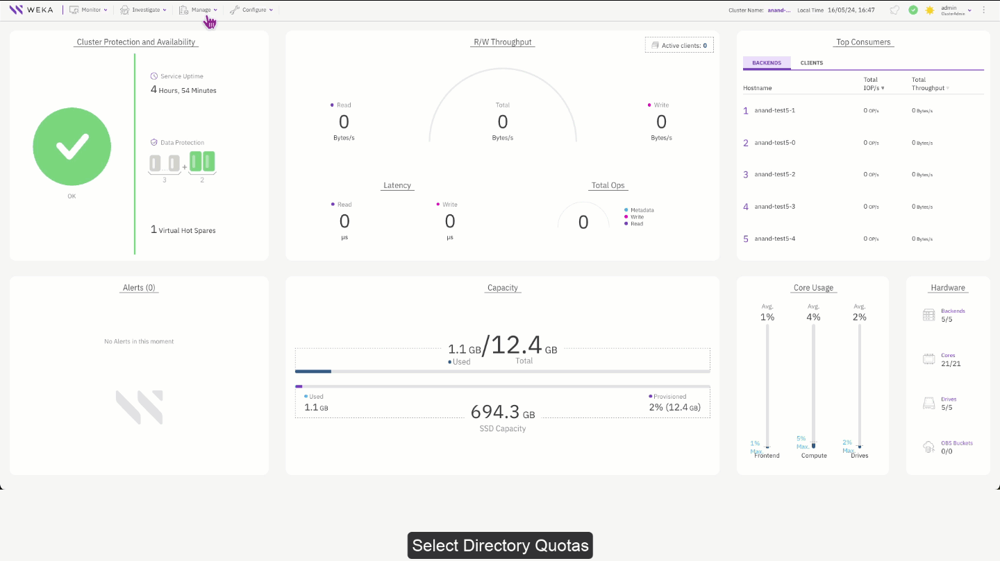
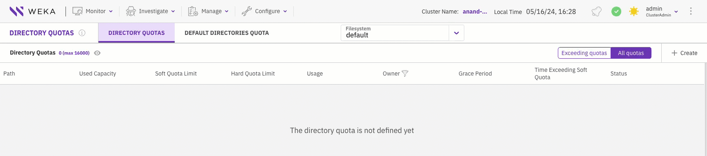
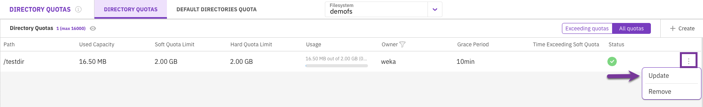
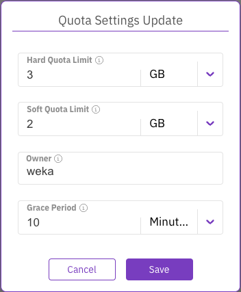
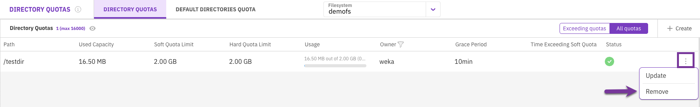

# Manage quotas using the GUI

Using the GUI, you can:

* [Set default directory quota](manage-quotas-using-the-gui.md#set-default-directory-quota)
* [Set directory quota](manage-quotas-using-the-gui.md#set-directory-quota)
* [View directory quotas and default quota](manage-quotas-using-the-gui.md#view-directory-quotas-and-default-quota)
* [Update a directory quota or default quota](manage-quotas-using-the-gui.md#update-a-directory-quota-or-default-quota)
* [Remove a directory quota](manage-quotas-using-the-gui.md#remove-a-directory-quota)
* [Remove the default quota for new directories](manage-quotas-using-the-gui.md#remove-the-default-quota-for-new-directories)


To manage user or group quota, use the CLI. See [quota-management.md](quota-management.md "mention").


## Set default directory quota

A default directory quota automatically applies quota limits to every new subdirectory created under a specified parent directory. It does not apply retroactively to existing subdirectories. Use it for cases where new directories should inherit consistent limits by default, such as user home directories or project folders.

**Before you begin**

Ensure a mount point to the relevant filesystem is set.

**Procedure**

1. From the menu, select **Manage > Directory Quotas**.
2. Select the **Default Directory Quotas** tab, then select **Create**.
3. Select the filesystem the default quota applies to..
4. In the **Create Default Quota** dialog, set the following fields:
   * **Directory Path:** The full path to the parent directory. New subdirectories created under this path will automatically inherit the quota.
   * **Hard Quota Limit:** The maximum capacity a subdirectory can use. Writes are blocked when this limit is reached.
   * **Soft Quota Limit:** The capacity threshold that starts the grace period timer. Writes are allowed until the grace period expires or the hard quota limit is reached.
   * **Owner:** Optional. An identifier for the directory owner, such as a username, email address, or Slack ID (up to 48 characters).
   * **Grace Period:** The time allowed after the soft quota limit is reached before writes are blocked.
5. Select **Save**.

<figure><figcaption>
Set default directory quota
</figcaption></figure>

## Set directory quota

The tenant admin can set a quota on a directory, which triggers a background task to calculate the current usage. Once this calculation is finished, the quota takes effect.

**Before you begin**

* To apply a quota to a directory, ensure there is a mount point for the relevant filesystem.
*   Configure at least one Data Services container before setting a directory quota. The **Create** button is not available until a Data Services container is active. See

    &#x20;See [set-up-a-data-services-container-for-background-tasks.md](../../operation-guide/background-tasks/set-up-a-data-services-container-for-background-tasks.md "mention").

**Procedure**

1. From the menu, select **Manage > Directory Quotas**.
2. Select **Directory Quotas**.
3. Select the filesystem the directory quota applies to.
4. In the Create Quota dialog, set the following:
   * **Directory Path:** The full path to the directory quota to be set on.
   * **Hard Quota Limit:** The hard quota limit defines the maximum used capacity above the soft quota limit, which prevents writing to the directory.
   * **Soft Quota Limit:** The soft quota limit defines the maximum used capacity that triggers a grace period timer. Data can be written to the directory until the grace period ends or the hard quota limit is reached.
   * **Owner:** The directory’s owner, such as user name, email, or slack ID (up to 48 characters).
   * **Grace Period:** When the soft quota limit is reached, a grace period starts. After this period, data cannot be written to the directory.\
     The system sets the directory quota in the background.
5. To monitor the directory quota setting background task, select **Monitor > Background Tasks.**

<figure><figcaption>
Set a directory quota and monitor the background task
</figcaption></figure>

## View directory quotas and default quota

You can view existing directory quotas and the default quota that are already set.

**Procedure**

1. From the menu, select **Manage > Directory Quotas**.
2. Select the relevant tab: **Directory Quotas** or **Default Directories Quota**.
3. Select the filesystem in which the directory quotas are already set.
4. To view all quotas or only the exceeding quotas, select the **Exceeding quotas/All quotas** switch.

<figure><figcaption>
View directory quotas and default quota
</figcaption></figure>

## Update a directory quota or default quota

You can update an existing directory quota or the default quota for directories. Updating the default quota only applies to new directories.

**Procedure**

1. From the menu, select **Manage > Directory Quotas**.
2. Select the relevant tab: **Directory Quotas** or **Default Directories Quota**.
3. Select the filesystem in which the directory quotas are set (through the CLI).
4. Select the three dots on the right of the required directory. From the menu, select **Update**.

<figure><figcaption>
Directory Quotas
</figcaption></figure>

5. In the Quota Settings Update dialog, modify the following settings according to your needs:
   * **Hard Quota Limit:** The hard quota limit defines the maximum used capacity above the soft quota limit, which prevents writing to the directory.
   * **Soft Quota Limit:** The soft quota limit defines the maximum used capacity that triggers a grace period timer. Data can be written to the directory until the grace period ends or the hard quota limit is reached.
   * **Owner:** The directory’s owner, such as user name, email, or slack ID (up to 48 characters).
   * **Grace Period:** When the soft quota limit is reached, a grace period starts. After this period, data cannot be written to the directory.
6. Click **Save**.

<figure><figcaption>
Quota Settings Update
</figcaption></figure>

## Remove a directory quota

You can remove (unset) a directory quota if it is no longer required.

**Procedure**

1. From the menu, select **Manage > Directory Quotas**.
2. Select the **Directory Quotas** tab.
3. Select the filesystem in which the directory quota is set.
4. Select the three dots on the right of the required default quota. From the menu, select **Remove**.
5. In the Quota Deletion message, select **Yes**.

<figure><figcaption>
Remove a default quota
</figcaption></figure>

## Remove the default quota for new directories

You can remove (unset) the default quota settings for new directories created in a specific filesystem. The quota of existing directories is not affected.

**Procedure**

1. From the menu, select **Manage > Directory Quotas**.
2. Select the **Default Directories Quota** tab.
3. Select the filesystem in which the default quotas are already set.
4. Select the three dots on the right of the required default quota. From the menu, select **Remove**.
5. In the Default Quota Deletion message, select **Yes**.
