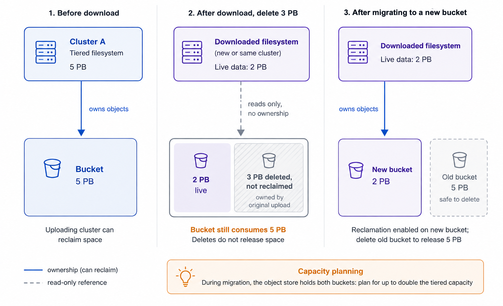

# Snap-To-Object

The Snap-To-Object feature enables the consolidation of all data from a specific snapshot, including filesystem metadata, every file, and all associated data, into an object store. The complete snapshot data can be used to restore the data on the WEKA cluster or another cluster running the same or a higher WEKA version.

## Snap-To-Object feature use cases

The Snap-To-Object feature is helpful for a range of use cases, as follows:

* **On-premises and cloud use cases**
  * [External backup of data](./#external-backup-of-data)
  * [Archiving data](./#archiving-data)
  * [Data replication](./#data-replication)
* **Cloud-only use cases**
  * [Cloud pause/restart](./#cloud-pauserestart)
  * [Data protection against cloud availability zone failures](./#data-protection-against-cloud-availability-zone-failures)
  * [Migration of filesystems to another region](./#migration-of-filesystems-to-another-region)
* **Hybrid cloud use case**
  * [Cloud bursting](./#cloud-bursting)

### External backup of data

Suppose it is required to recover data stored on a WEKA filesystem due to a complete or partial loss of the data within it. You can use a data snapshot saved to an object store to recreate the same data in the snapshot on the same or another WEKA cluster.

This use case supports backup in any of the following WEKA system deployment modes:

* **Local object store:** The WEKA cluster and object store are close to each other and will be highly performant during data recovery operations. The WEKA cluster can recover a filesystem from any snapshot on the object store for which it has a reference locator.
* **Remote object store:** The WEKA cluster and object store are located in different geographic locations, typically with longer latencies between them. In such a deployment, you can send snapshots to local and remote object stores.


This deployment type requires supporting the latency of hundreds of milliseconds. For performance issues on Snap-To-Object tiering cross-interactions/resonance, contact the [Customer Success Team](../../support/getting-support-for-your-weka-system.md).


* **Local object store replicating to a remote object store:** A local object store in one data center replicates data to another object store using the object store system features, such as [AWS S3 cross-region replication](https://docs.aws.amazon.com/AmazonS3/latest/dev/crr.html).\
  This deployment provides both integrated tiering and Snap-To-Object local high performance between the WEKA object store and the additional object store. The object store manages the data replication, enabling data survival in multiple regions.


This deployment requires ensuring that the object store system perfectly replicates all objects on time to ensure consistency across regions.


### Archiving data

The periodic creation and uploading of snapshots to an object store generate an archive, allowing access to past copies of data.

When any compliance or application requirement occurs, it is possible to make the relevant snapshot available on a WEKA cluster and view the content of past versions of data.

### Data replication

Combining a local cluster with a replicated object store in another data center allows for the following use cases:

* **Disaster recovery:** where you can take the replicated data and make it available to applications in the destination location.
* **Backup:** where you can take multiple snapshots and create point-in-time images of the data that can be mounted, and specific files may be restored.

### Cloud pause/restart

In a public cloud, with a WEKA cluster running on compute instances with local SSDs, sometimes the data needs to be retained, even though ongoing access to the WEKA cluster is unnecessary. In such cases, using Snap-To-Object can save the costs of compute instances running the WEKA system.

To pause a cluster, you need to take a snapshot of the data and then use Snap-To-Object to upload the snapshot to an S3-compliant object store. When the upload process is complete, the WEKA cluster instances can be stopped, and the data is safe on the object store.

To re-enable access to the data, you need to form a new cluster or use an existing one and download the snapshot from the object store.

### Data protection against cloud availability zone failures

This use case ensures data protection against cloud availability zone failures in the various clouds: AWS Availability Zones, Google Cloud Platform (GCP) Zones, and Oracle Cloud Infrastructure (OCI) Availability Domains.

In AWS, for example, the WEKA cluster can run on a single availability zone, providing the best performance and no cross-AZ bandwidth charges. Using Snap-To-Object, you can take and upload snapshots of the cluster to S3 (which is a cross-AZ service). If an AZ failure occurs, a new WEKA cluster can be created on another AZ, and the last snapshot uploaded to S3 can be downloaded to this new cluster.

### Migration of filesystems to another region

Using WEKA snapshots uploaded to S3 combined with S3 cross-region replication enables the migration of a filesystem from one region to another.

### Cloud bursting

On-premises WEKA deployments can often benefit from cloud elasticity to consume large quantities of computation power for short periods.

Cloud bursting requires the following steps:

1. Take a snapshot of an on-premises WEKA filesystem.
2. Upload the data snapshot to S3 at AWS using Snap-To-Object.
3. Create a WEKA cluster in AWS and make the data uploaded to S3 available to the newly formed cluster at AWS.
4. Process the data in-cloud using cloud compute resources.

Optionally, you may also promote data back to on-premises by doing the following:

1. Take a snapshot of the WEKA filesystem in the cloud on completion of cloud processing.
2. Upload the cloud snapshot to the on-premises WEKA cluster.

## Snapshots management considerations

* **Simultaneous snapshot uploads**: WEKA supports concurrent uploads of multiple snapshots from different filesystems to both remote and local object stores.
* **Writeable snapshots cannot be uploaded**: A writeable snapshot is a clone of the live filesystem or other snapshots at a specific point in time. Because its data continues to change, the snapshot cannot be uploaded to the object store as a read-only snapshot and is tiered according to existing policies.
* **Snapshot upload order**: Uploading snapshots to a remote object store benefits from a chronological approach. When uploading a monthly snapshot, it may be more efficient to first upload the preceding daily snapshots.
* **Snapshot deletion and upload constraints**: Parallel deletion during snapshot upload requires careful handling. The local snapshot upload pauses and waits for any pending snapshot deletion, which only proceeds after the remote snapshot upload is complete.
* **Pausing or aborting snapshot uploads**: Users can pause or abort snapshot uploads using commands detailed in the background tasks section.
* **New filesystem creation from snapshots**: When creating a new filesystem from a snap-to-object operation, the original filesystem quotas are not preserved in the new filesystem.


The system does not support restoring or downloading a filesystem from snapshots stored in object storage when the object store is located within the same cluster.


## Synchronous snapshots

Synchronous snapshots are point-in-time backups for filesystems. When taken, they consist only of the changes since the last snapshot (incremental snapshots). When you download and restore a snapshot to a live filesystem, the system reconstructs the filesystem on the fly with the changes since the previous snapshot.

This capability for filesystem snapshots makes them more cost-effective because you do not have to update the entire filesystem with each snapshot. You only update the changes since the last snapshot.

It is recommended that the synchronous snapshots be applied in chronological order.

## Object store space reclamation after a snapshot download

When you download a snapshot to create a filesystem (`weka fs download`), the new filesystem reads the objects in the bucket but does not take ownership of them. A filesystem reclaims space only for objects it wrote itself. Objects inherited from a downloaded snapshot are never modified or deleted by the new filesystem, regardless of which cluster originally uploaded them. This applies even when the snapshot was uploaded from the same cluster. As a result, deleting data from the downloaded filesystem does not release space in the object store bucket.

**Example**: A tiered filesystem consumes 5 PB in the object store bucket. After you download its snapshot to a new filesystem and delete 3 PB of data, the bucket still consumes 5 PB.

<figure><figcaption>
Object store space reclamation after a snapshot download
</figcaption></figure>

To enable space reclamation for a downloaded filesystem, migrate it to a different object store bucket. During migration, the object store must accommodate the original data and the migrated data. This temporarily requires up to twice the filesystem’s tiered capacity. Delete the original data after migration completes.

## Delete snapshots residing on an object store

Deleting a snapshot uploaded from a filesystem removes all its data from the local object store bucket. It does not remove any data from a remote object store bucket.


If the snapshot has been (or is) downloaded and used by a different filesystem, deleting it causes that filesystem to stop functioning correctly. Data can become unavailable, and errors can occur when accessing the data.Before deleting the snapshot, un-tier the downloaded filesystem or migrate it to a different object store bucket. See [Attach or detach object store buckets](../attaching-detaching-object-stores-to-from-filesystems/).


## Snap-To-Object and tiering

Snap-To-Object and tiering use SSDs and object stores for data storage. The WEKA system uses the same paradigm for holding SSD and object store data for both Snap-To-Object and tiering to save storage and performance resources.

You can implement this paradigm for each filesystem using one of the following use cases:

* **Data resides on the SSDs only, and the object store is used only for the various Snap-To-Object use cases, such as backup, archiving, and bursting:**\
  The allocated SSD capacity must be identical to the filesystem size (total capacity) for each filesystem. The drive retention period must be defined as the longest time possible (which is 60 months).\
  The Tiering Cue must be defined using the same considerations based on IO patterns. In this case, the applications always work with a high-performance SSD storage system and use the object store only as a backup device.
* **Snap-To-Object on filesystems is used with active tiering between the SSDs and the object store:**\
  Objects in the object store are used to tier all data and back up using Snap-To-Object. If possible, the WEKA system uses the same object for both purposes, eliminating the unnecessary need to acquire additional storage and copy data.


When using Snap-To-Object to promote data from an object store, some metadata may still be in the object store until it is accessed for the first time.


**Related topics**

[snap-to-obj.md](snap-to-obj.md "mention")

[snap-to-obj-1.md](snap-to-obj-1.md "mention")
