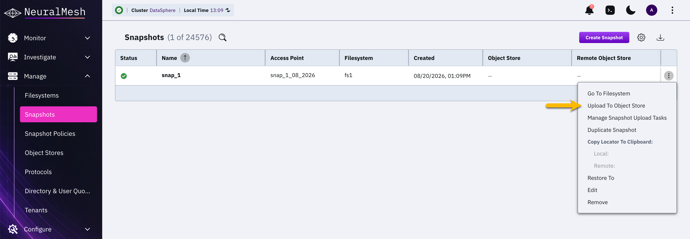
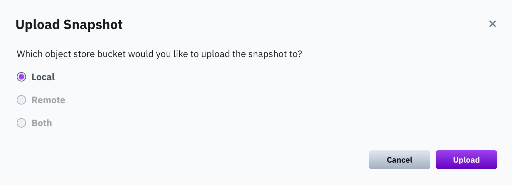
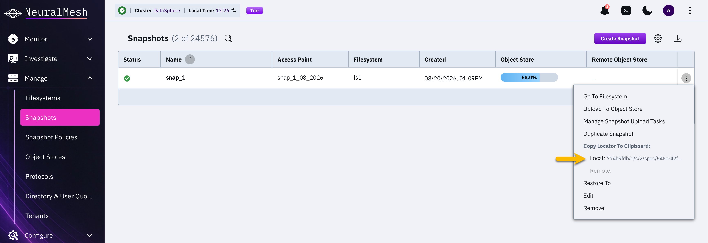
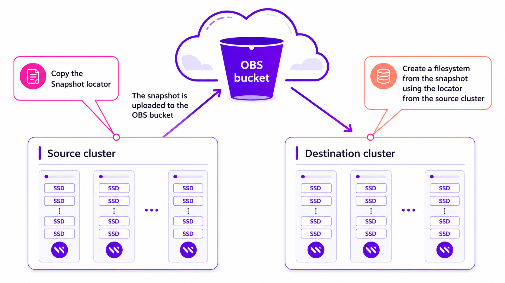
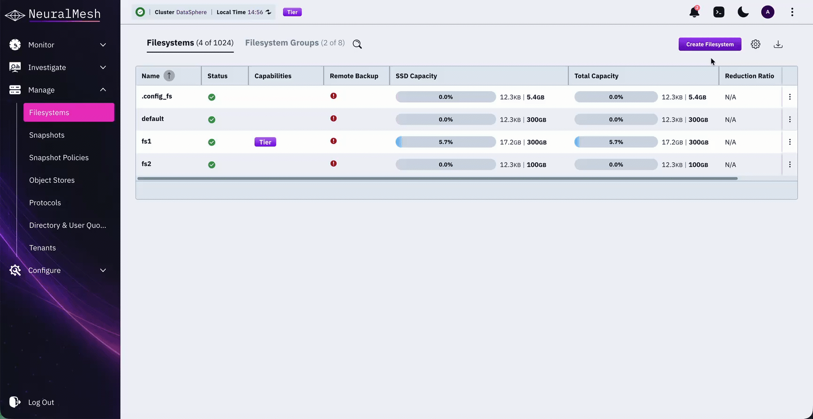
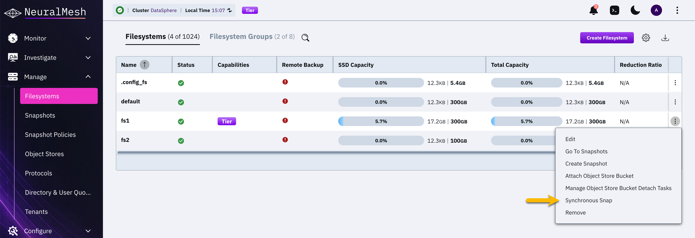
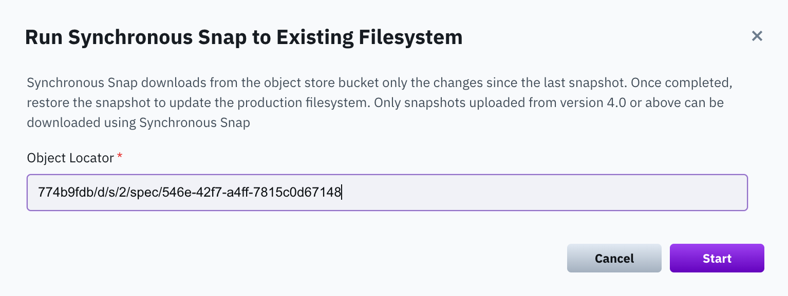

# Manage Snap-To-Object using the GUI


For viewing, creating, updating, deleting, or restoring snapshots, see [snapshots.md](../snapshots/snapshots.md "mention").


## Upload a snapshot

You can upload a snapshot to a local, remote, or both object store buckets.

**Procedure**

1. From the menu, select **Manage > Snapshots**.
2. Select the three dots on the right of the required snapshot. From the menu, select **Upload To Object Store**.

3. A relevant message appears if a local or remote object store bucket is not attached to the filesystem. It enables opening a dialog to select an object store bucket and attach it to the filesystem. To add an object store, select **Confirm**.
4. In the Attach Object Store to Filesystem dialog, select the object store bucket to attach the snapshot.

5. Select **Upload**.\
   A confirmation message appears. Select **Confirm**. The snapshot is uploaded to the target object store bucket.
6. **Copy the snapshot locator:**
   * Select the three dots on the right of the required snapshot, and select **Copy Locator to Clipboard**.
   * Save the locator in a dedicated file so later you can use it for creating a filesystem from the uploaded snapshot.

***

**Related topics**

[Background tasks](../../operation-guide/background-tasks.md#control-background-tasks)

## Create a filesystem from an uploaded snapshot

You can create (or recreate) a filesystem from an uploaded snapshot, for example, when you need to migrate the filesystem data from one cluster to another.

When recreating a filesystem from a snapshot, adhere to the following guidelines:

* **Pay attention to upload and download costs**: Due to the bandwidth characteristics and potential costs when interacting with remote object stores, it is not allowed to download a filesystem from a remote object store bucket. If a snapshot on a local object store bucket exists, it is advisable to use that one. Otherwise, follow the procedure in the [Recover from a remote snapshot](snap-to-obj-1.md#recover-a-filesystem-from-a-remote-only-snapshot) topic using the CLI.
* **Use the same KMS master key**: For an encrypted filesystem, to decrypt the snapshot data, use the same KMS master key as used in the encrypted filesystem. See the [KMS Management Overview](../../security/kms-management/#overview) topic.

<figure><figcaption>
Create a filesystem from an uploaded snapshot example
</figcaption></figure>

**Before you begin**

* Verify that the locator of the required snapshot (from the source cluster) is available (see the last step in the [Upload a snapshot](snap-to-obj.md#upload-a-snapshot) procedure).
* Ensure the object store is attached to the destination cluster.

**Procedure**

1. Connect to the destination cluster where you want to create the filesystem.
2. From the menu, select **Manage > Filesystems**, and select **Create Filesystem**.
3. In the Create Filesystem, do the following:
   * Set the filesystem name, group, and tiering properties.
   * Select **Create From Uploaded Snapshot** (it only appears when you select **Tiering**).\
     Paste the copied snapshot locator in the Object Store Bucket Locator (from the source cluster).\
     In the Snapshot Name, set a meaningful snapshot name to override the default (uploaded snapshot name).\
     In the Access Point, set a meaningful access point name to override the default (uploaded access point name) for the directory that serves as the snapshot's access point.
4. Select **Create**.

## Sync a filesystem from a snapshot 

You can synchronize a filesystem from a snapshot using the Synchronous Snap feature (incremental snapshot). Synchronous Snap only downloads changes since the last snapshot from the object store bucket.


Only snapshots uploaded from version 4.3 or later can be downloaded using Synchronous Snap.


**Before you begin**

Copy the locator of the snapshot you want to sync with the filesystem.

**Procedure**

1. From the menu, select **Manage > Filesystems**.
2. From the Filesystems page, select the three dots of the filesystem you want to sync, and from the menu, select **Synchronous Snap**.

<figure><figcaption>
Filesystem menu: Synchronous Snap
</figcaption></figure>

3. Paste the snapshot object locator in the Run Synchronous Snap to Existing Filesystem dialog.

<figure><figcaption>
Run synchronous snap to an existing filesystem
</figcaption></figure>

4. Select **Start**.\
   The filesystem starts syncing with the snapshot.
5. Once the sync is completed, restore the snapshot to update the production filesystem.

**Related topics**

[#add-a-filesystem](../managing-filesystems/managing-filesystems.md#create-a-filesystem "mention")
