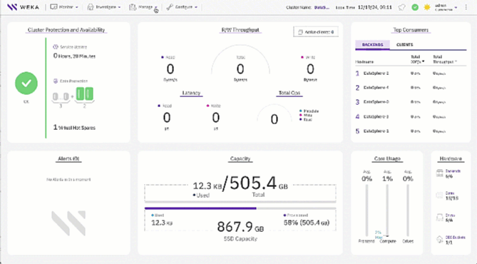

# Snapshot policies

## Overview

Snapshot policies establish the rules and schedules for creating, managing, and retaining point-in-time copies of data, known as snapshots. These snapshots provide a reliable mechanism for data recovery or rollback in scenarios such as accidental deletion, corruption, or other data integrity issues.

By automating the creation of snapshots based on specified criteria, such as time intervals or frequency, snapshot policies enhance data protection, streamline disaster recovery, and ensure business continuity. They enable organizations to restore their data to a consistent state quickly without requiring full backups, optimizing storage usage while minimizing the risk of data loss.

WEKA provides a default system policy that can serve as a foundation for customizing snapshot policies. Each policy defines the following key parameters:

* **Schedule:** Specifies when snapshots are created, including hourly, daily, weekly, monthly, or at periodic intervals.
* **Retention:** Determines the number of snapshots to retain, defining a rotation policy.
* **Destination:** Determines whether snapshots are also uploaded to a local and remote object store.

Background tasks handle operations related to snapshots, including creation and uploads to local or remote object stores. This system operates in the background to improve efficiency and ensure uninterrupted performance during snapshot management processes.

Administrators of the root organization only can configure policies to create hourly, daily, weekly, monthly, and periodic snapshots. These policies can be assigned to filesystems already connected to a local or remote object store.

The example below demonstrates how to configure a policy using the GUI. The policy schedules a snapshot every Saturday and uploads it to a local object store. Alternatively, you can use CLI commands to achieve the same result.

<figure><figcaption>
Create a snapshot policy
</figcaption></figure>

## General guidelines and considerations

* **Plan and structure policies:**
  * Decide whether to store snapshots on the local server or upload them to a local or remote object store.
  * If uploading snapshots to an object store, configure the filesystem to use the appropriate local or remote object store before attaching the policy.
  * Attach a snapshot policy to each filesystem.
  * Design policies based on workload priorities, recovery objectives, and storage capacity requirements.
* **Adhere to system limits:**
  * You can define up to **1,024 snapshot policies** across the cluster, in addition to the default policy.
  * A single snapshot policy can be attached to maximum **1,024 filesystems**.
  * A single filesystem can have maximum **10 snapshot policies** assigned.
* **Optimize policy assignments:**
  * Consolidate policies wherever possible to reduce complexity and duplication.
* **Monitor object store connectivity:**
  * Ensure that each filesystem is properly connected to a local or remote object store to enable seamless assignment to a snapshot policy.
*   **Multiple schedules overlap:**

    * When multiple schedules overlap on the same filesystem, only one snapshot is taken, following this priority:
      1. **Monthly** (highest priority)
      2. **Weekly**
      3. **Daily**
      4. **Hourly**
      5. **Periodic** (lowest priority)

    This means that if multiple schedules overlap, the snapshot with the highest priority (for example, Monthly) are taken, and the lower-priority ones (for example, Weekly, Daily, Hourly, Periodic) are skipped. This hierarchy prevents redundant snapshots. Plan schedules accordingly.
* **Snapshot name format:**
  * \<policy name>-\<schedule type>.\<time-stamp format: YYMMDDHHMM>
  * Example: `policy1-weekly.2412301152`
* **Restricted manual uploads of policy-based snapshots:**
  * Snapshots created by policies cannot be manually uploaded to an object store. Ensure all uploads align with the configured policy.
* **Retaining snapshots outside rotation:**
  * To prevent a snapshot from being deleted during the rotation process, rename the snapshot to exclude it from automated deletion.
* **Manually upload snapshots to object store:**
  * To manually upload a policy-created snapshot that isn't configured for automatic object store upload, rename the snapshot. This change enables you to manually upload the snapshot and prevents automatic deletion.
* **Snapshot deletion with disabled policy:**
  * Snapshots of attached filesystems may still be deleted even when the policy is disabled. If the retention period is reduced, snapshots are deleted according to the updated retention settings, regardless of the policy's status.
*   **Snapshot behavior during DST transitions**:

    The following behavior applies to snapshot schedules during Daylight Saving Time (DST) transitions:

    * **DST starts (clocks move forward):** The system creates snapshots scheduled in the skipped hour (for example, 2:00 AM to 3:00 AM) after the corresponding duration in the skipped interval, immediately following clock adjustment. For example, if a snapshot is scheduled for 2:15 AM, the system creates it at 3:15 AM. The system skips any other snapshot for the same schedule between 2:15 AM and 3:15 AM.
    * **DST ends (clocks move back):** The system does not duplicate snapshots scheduled in the repeated hour (for example, 1:00 AM to 2:00 AM), because the system already created them during the first pass.

**Related topics**

[snapshots](../snapshots/ "mention")

[background-tasks](../../operation-guide/background-tasks/ "mention")
