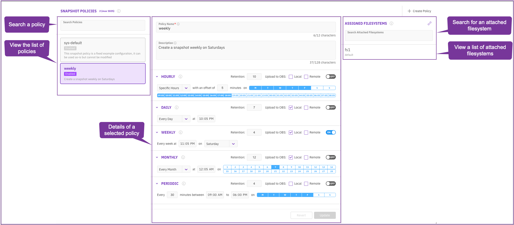
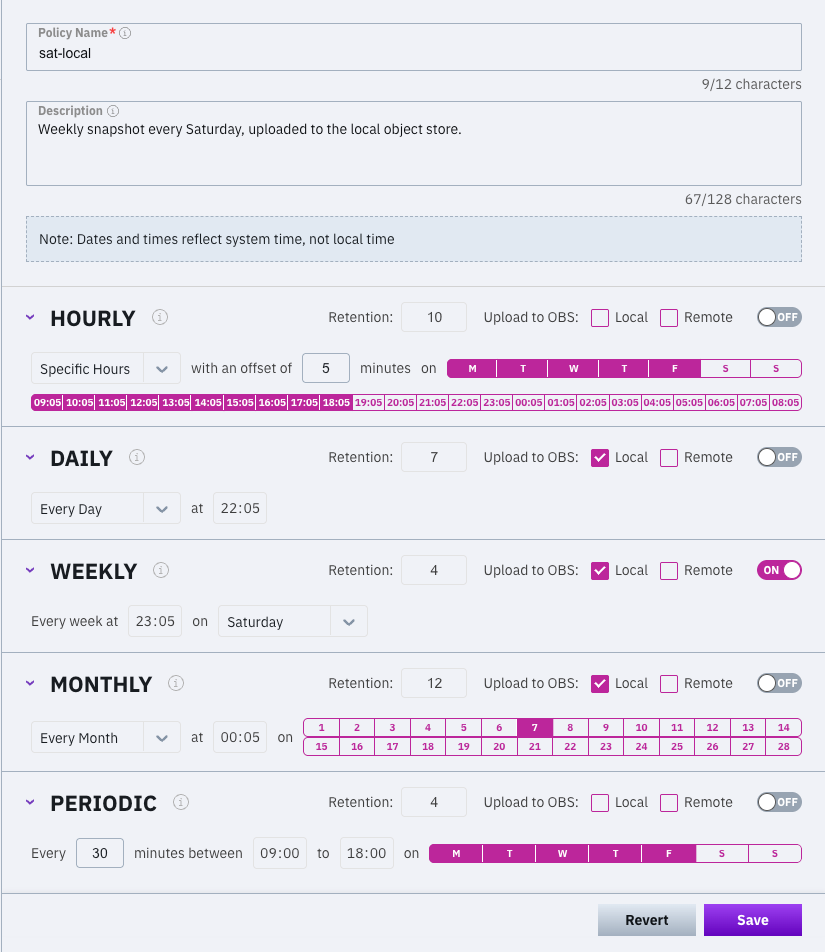
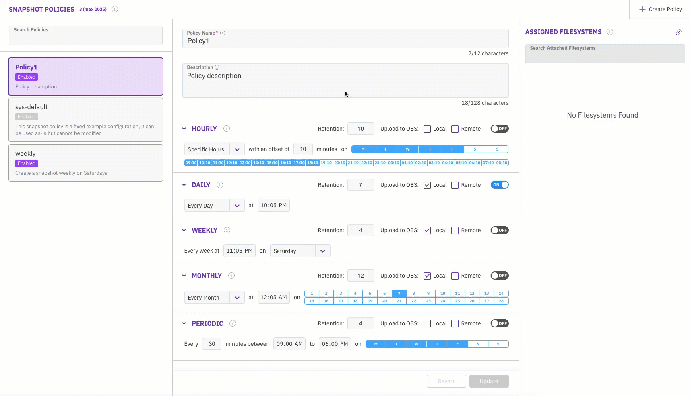
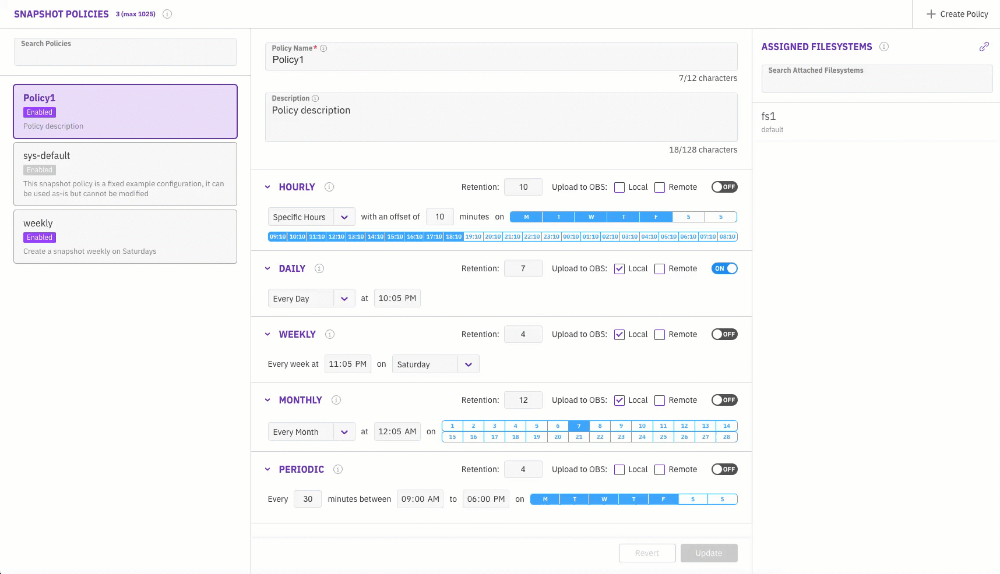
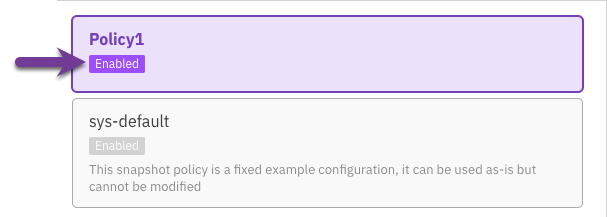
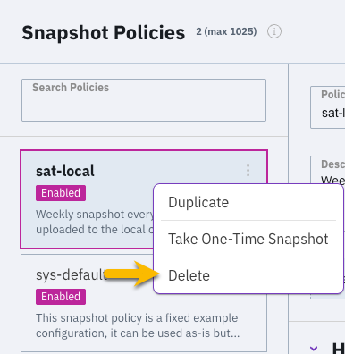

# Manage snapshot policies using the GUI

Using the GUI, you can:

* Explore the snapshot policies
* Create a snapshot policy
* Attach filesystems to a snapshot policy
* Detach a filesystem from a snapshot policy
* Modify an existing snapshot policy
* Delete a snapshot policy

## Explore the snapshot policies

The **Snapshot Policies** page provides a centralized interface for managing and reviewing snapshot policies. This page allows administrators to search for specific policies, view a comprehensive list of configured policies, and examine detailed information about individual policies. Additionally, you can search for filesystems attached to a policy and view a list of all associated filesystems.

The following is a screenshot of the Snapshot Policies page with callouts highlighting its key features:

* **Search a policy:** Filter and identify specific snapshot policies by entering keywords in the search bar.
* **View the list of policies:** Browse all configured snapshot policies in a clear list format.
* **Details of a selected policy:** Access detailed configuration and status information for a highlighted snapshot policy.
* **Search for an attached filesystem:** Filter and identify specific filesystems assigned to the selected snapshot policy by entering keywords in the search bar.
* **View a list of attached filesystems:** See all filesystems assigned with the selected snapshot policy.

<figure><figcaption>
Snapshot policies
</figcaption></figure>

**Procedure**

1. From the **Manage** menu, select **Snapshot Policies**.

The next sections describe how to perform common tasks on this page, leveraging the features highlighted above.

## Create a snapshot policy

This procedure guides you through creating a snapshot policy, which includes defining the policy name, description, schedule, retention settings, and optional upload configuration. Follow these steps to configure a policy tailored to your data protection requirements.

<figure><figcaption>
Create a snapshot policy
</figcaption></figure>

**Procedure**

1. From the **Manage** menu, select **Snapshot Policies**.
2. On the top-right of the **Snapshot Policies** page, select **+Create Policy**.
3. Configure the following settings:
   * **Policy Name:** Provide a descriptive name for the snapshot policy, up to 12 characters.
   * **Description:** Enter a brief description of the policy's purpose, up to 128 characters.
   * **Schedule:** Select the desired scheduling option:
     * **Hourly:** Creates one snapshot in specific hours or per hour with a customizable start time (offset).
     * **Daily:** Creates one snapshot at specific times and days.
     * **Weekly:** Creates one snapshot on specified days and times each week.
     * **Monthly:** Supports up to four snapshots on specified days, either monthly or in selected months.
     * **Periodic:** Creates snapshots at custom intervals within a defined time window.
   * **Retention:** Define the number of snapshots to retain, allowing for automatic rotation. Alternatively, use the default retention settings for the selected schedule.
   * **Upload to OBS (Object Store):** Specify whether to upload snapshots to a local, remote, or both object stores.
   * **Enable or disable the schedule:**
     * **ON:** Enable the schedule.
     * **OFF:** Disable the schedule.
4. Select **Save** to finalize the policy configuration.

The newly created snapshot policy appears in the list on the **Snapshot Policies** page.

## Attach filesystems to a snapshot policy

Attaching filesystems to a snapshot policy ensures that the policy governs the creation, management, and retention of snapshots for these specific filesystems. This association helps maintain consistent data protection and recovery practices across selected filesystems.

<figure><figcaption>
Attach a snapshot policy to a filesystem
</figcaption></figure>

**Procedure**

1. Select the snapshot policy to which you want to attach a filesystem from the **Snapshot Policies** list.
2. In the **Assigned Filesystems** pane on the right, click the **Attach Filesystems** icon (represented by a link symbol) to open the attachment dialog.
3. Select the required filesystems from the available list.
4. Select **Attach** to complete the process.

The filesystem is associated with the selected snapshot policy, and the policy's configurations apply to snapshots for the attached filesystem.

## Detach filesystems from a snapshot policy

Detaching filesystems from a snapshot policy can be necessary when you no longer need to associate the filesystems with the policy, either due to changes in backup strategies or system configurations. This procedure ensures that the filesystems are removed from the policy without affecting its data or storage.

<figure><figcaption>
Detach a snapshot policy from a filesystem
</figcaption></figure>

**Procedure**

1. Navigate to the list of snapshot policies and choose the one from which you want to detach filesystems.
2. In the **Assigned Filesystems** pane (on the right), locate the filesystems you want to detach.
3. Move your mouse over the **Detach** icon (represented by an unlink symbol).
4. In the Detach dialog, choose **ON** if you also want to remove any waiting tasks associated with the filesystems.
5. Select **Detach** to complete the process.

## Modify an existing snapshot policy

Updating a snapshot policy is necessary when modifications to schedules, retention settings, or other parameters are required to align with evolving data protection needs. Regularly reviewing and updating policies ensures that they remain effective and consistent with organizational objectives.

<figure><figcaption>
Update a snapshot policy
</figcaption></figure>

**Procedure**

1. Select the snapshot policy you want to update from the **Snapshot Policies** list.
2. Modify the policy configuration as needed:\
   Update the policy name, description, schedule, retention, object store upload, or status settings.
3. Select **Save** to apply the changes.

The updated snapshot policy immediately reflects the new configuration and continue managing snapshots based on the revised settings.

## Set policy status

You can enable or disable a policy directly from the policies list pane, for example, to temporarily disable a policy while adjusting configurations.

**Procedure**

1. In the policies list pane, locate the desired policy.
2. Click on the current status of the policy (Enabled or Disabled).

<figure><figcaption></figcaption></figure>

3. In the confirmation message that appears, select **Yes** to confirm the status change.

<figure><figcaption></figcaption></figure>

## Delete a snapshot policy

Snapshot policies may need to be deleted when they are no longer required, are incorrectly configured, or are replaced by updated policies. Removing unnecessary policies helps maintain a clean and manageable environment, ensuring that only relevant configurations are active.

<figure><figcaption>
Delete a snapshot policy
</figcaption></figure>

**Procedure**

1. Select the snapshot policy you wish to delete from the **Snapshot Policies** list.
2. Move your mouse over the policy and click the **trash icon**.
3. In the **Remove Snapshot Policy** confirmation message, select **Yes** to confirm the deletion.

The selected snapshot policy is permanently removed and is no longer appear in the policy list.
