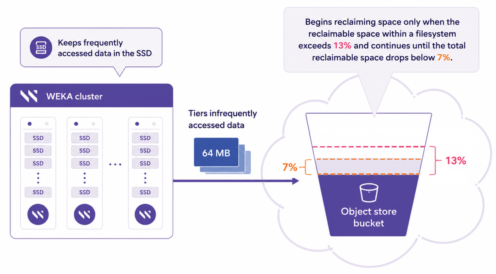
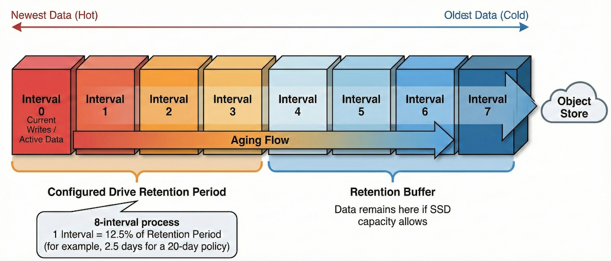

# Manage data lifecycle for tiered systems

## Tiered storage overview

WEKA tiered storage combines high-speed SSD performance with object storage scalability. It automatically optimizes data placement to manage costs without sacrificing speed.

Active data resides on the SSD tier for maximum performance. Inactive data moves to the object storage tier for cost efficiency. This architecture provides scalable capacity while maintaining SSD-like performance for the active working set.

The system automates data movement based on configured policies. Administrators define time-based rules, and the system manages the transition between tiers. This capability eliminates the need for manual file migration or classification.

**Related information**

[data-storage.md](../weka-system-overview/data-storage.md "mention")

## Data lifecycle policy controls

Two time-based policies govern the data lifecycle in a tiered filesystem: the tiering cue and the drive retention period. These policies function as timing controls, determining when the system copies data to the object store and how long it remains cached on the SSD.

**Policy configuration scope:** Tiering cues and drive retention periods are configured at the filesystem group level. This architecture enforces consistent data aging and retention policies across all filesystems assigned to a specific group. When planning data lifecycle strategies, define the configuration requirements for the entire group rather than individual filesystems.

### Tiering cue

The tiering cue defines the wait time after a data write before the system copies it to the object store. This delay prevents the unnecessary transfer of temporary or rapidly changing data. For example, temporary analysis files created and deleted within an hour never consume object store bandwidth if the tiering cue exceeds that duration.

**Key behaviors:**

* **Timer reset:** If an application modifies data during the waiting period, the system resets the timer. Actively changing data remains on the SSD and does not cycle between tiers.
* **Chunk-level granularity:** The system manages data in chunks (up to 1 MB), tracking timestamps independently for each chunk. Consequently, frequently modified parts of a large file remain on the SSD, while unchanged parts tier to the object store.
* **Configuration constraint:** The tiering cue cannot exceed one-third of the drive retention period.

#### Guidelines for tiering cue configuration

Optimize storage efficiency and performance by aligning the tiering cue settings with specific workload patterns.

* **Write-once workloads:** For data such as sensor captures or finished renders, set a short tiering cue. The minimum value is 10 seconds, and the default is 15 minutes. This setting facilitates rapid tiering to the object store.
* **Active editing:** For data undergoing frequent modification, set a longer tiering cue, typically measured in days or weeks. This configuration ensures data remains on the high-performance tier until it stabilizes.

### Drive retention period

The drive retention period determines how long data remains cached on the SSD after the system successfully copies it to the object store. This policy maintains a read cache of recently tiered data to ensure fast access.

**Key behaviors:**

* **SSD caching:** Data copied to the object store remains on the SSD for low-latency access. This leverages the principle of temporal locality, assuming recently accessed data is likely to be accessed again.
* **Data release:** When the retention period expires, the system releases the SSD copy to free space for new data. The authoritative copy remains in the object store.
* **Re-caching:** Accessing released data retrieves it from the object store and writes it back to the SSD with a new timestamp.

**Capacity considerations**

The drive retention period acts as a target, not a guarantee. If the data ingest rate exceeds the SSD capacity within the configured period, the system releases data early to prevent SSD exhaustion.

#### Guidelines for retention period configuration

Align retention periods with user access patterns and available storage resources to optimize performance and capacity management.

* **High access frequency:** Configure a longer retention period, for example, 30 days, when users frequently access recent data. This configuration keeps data on the high-performance tier to ensure low-latency access for ongoing operations.
* **Limited SSD capacity:** Configure a shorter retention period if SSD capacity is limited relative to the data generation rate. This configuration frees up high-performance storage resources more rapidly, preventing the cluster from reaching capacity limits.

**Related topic**

[managing-filesystem-groups](managing-filesystem-groups/ "mention")

## Data flow in tiered systems

Understanding the lifecycle of data in a tiered system helps predict performance behavior and interpret observations during monitoring and troubleshooting. The data journey involves writing, tiering, retention, release, and reclamation.

### Write operations

All data written to a tiered filesystem initially lands on the SSD tier. The system does not write directly to the object store, ensuring write completion at SSD latency.

Upon ingestion, the system assigns a creation timestamp to the data. This timestamp serves as the reference for subsequent tiering decisions. At this stage, the data resides exclusively on the SSD (write-cache state).

**Chunk-level management:** The system tracks modifications at a fine granularity, maintaining timestamps per data chunk (up to 1 MB) rather than per file. When an application modifies a specific chunk within a large file, only that chunk’s timestamp is refreshed.

This model enables efficient handling of mixed access recency within a single file. For example, a large database file can contain recently modified chunks that remain on the SSD alongside older, unmodified chunks that are eligible for tiering.

### Tiering process

Once the Tiering Cue period expires for a chunk, the system begins copying that data to the object store in the background. This process does not interrupt application access.

**Object bundling:** To improve object store efficiency, the system bundles data from multiple files and chunks into larger objects, typically up to 64 MB. This reduces the number of stored objects, lowers management costs, and optimizes bandwidth usage. This bundling is transparent; the system maintains metadata mapping file data to specific regions within bundled objects.

**Handle modifications during tiering:** If an application modifies data during the tiering process, the modified chunks receive new timestamps and exit the current tiering operation. Portions already copied to the object store remain there to prevent inconsistencies.

### Retention and release

After copying to the object store, data enters the read cache state, existing on both the SSD and the object store. The SSD copy remains available for fast access according to the configured Drive Retention Period.

**Release process:** When cached data exceeds the retention period, the system releases it by removing the SSD copy while preserving the object store copy. This frees SSD capacity for newer data. The system prioritizes releasing the oldest cached data first.

**Read-path cache promotion:** When accessed, released data is retrieved from the object store and automatically promoted to the SSD read cache. The system assigns the chunk a new access timestamp to track recency. Once cached, the chunk persists on the SSD and is not re-uploaded to the object store unless explicitly rewritten or evicted during cache reclamation. This mechanism ensures that frequently accessed data remains in the high-performance SSD cache tier, independent of the data's original write time.

### Object storage space reclamation

Data bundling impacts storage efficiency. When users delete or modify files, the system marks the space they occupied within up to 64 MB objects as reclaimable rather than immediately freeing it.

**Reclamation thresholds:** The system tracks reclaimable space per filesystem to trigger the reclamation process:

* **Start threshold:** Reclamation begins automatically when reclaimable space exceeds 13% of the total object storage usage.
* **Stop threshold:** The process continues until reclaimable space drops below 7%.

**Reclamation overhead:** The reclamation process reads objects with significant reclaimable space, rewrites active data into new objects, and deletes the fragmented ones. Consequently, object storage usage typically runs 7–13% higher than the logical size of active data.


For filesystems created from uploaded snapshots, only data written _after_ creation is eligible for reclamation. Data inherited from the snapshot remains in its original layout.


<div data-with-frame="true"><figure><figcaption><p>Object store space reclamation</p></figcaption></figure></div>

## System behavior under resource constraints

Operational constraints can force the system to deviate from configured policies. Understanding the system's behavior under these conditions assists in interpreting system status and diagnosing issues.

### Time-based data management

The system organizes data temporally to manage releases efficiently when SSD capacity is limited. This organization relies on a mechanism known as the 8-interval process.

**The 8-interval process:** The system groups data into time-based intervals to track data age and access recency, referred to as temperature. It maintains a rolling window of intervals, designated as Interval 0 through Interval 7, on the SSD.

**Interval calculation:** The duration of a single interval is calculated as one-quarter of the configured Drive Retention Period.

* Example 1: A 20-day retention period results in 5-day intervals.
* Example 2: A 40-day retention period results in 10-day intervals.

**Data aging:** New or recently accessed data belongs to Interval 0, which represents the hottest data. As time passes, this data ages and moves sequentially to higher intervals, such as Interval 1, Interval 2, and so on.

**Retention window:** The system effectively tracks data across these 8 intervals. Since the retention period is covered by the first 4 intervals (4 x 1/4), the additional intervals (Interval 4 through Interval 7) function as a buffer. This buffer retains data on the SSD beyond the minimum policy requirement if capacity allows.

**Release granularity:** The system makes release decisions at the interval level rather than the file level. When the system requires SSD space, it releases the oldest complete interval to the object store. This coarse-grained approach tracks and manages billions of files efficiently across storage servers.

**Implications:** Release granularity implies inherent imprecision in the effective drive retention period. For example, with a 20-day retention period consisting of 5-day intervals, the system might retain data for 20 to 40 days, depending on interval alignment and available capacity. While the system guarantees the release of data significantly older than the target, the exact retention varies within the margin of the interval size.

<div data-with-frame="true"><figure><figcaption><p><strong>The 8-interval data aging process</strong></p></figcaption></figure></div>

### High write rates and capacity limits

A constraint scenario occurs when data write rates exceed the SSD capacity required to support the configured retention period.

**System behavior:** If the workload generates more data than the SSD can hold for the full retention period, the system releases data early to prioritize system availability.

**Example: Effective retention vs. configured policy**

Consider a cluster with 100 TB of SSD capacity and a configured 20-day retention policy. If the workload writes 8 TB of new data daily, the SSD reaches capacity in approximately 12.5 days (100 TB/8 TB/day).

To prevent the SSD from filling, the system releases the oldest data intervals (starting with Interval 0) early. This effectively reduces the actual retention period to approximately 10–15 days. While applications continue to function normally, data older than this effective period moves to the object store sooner than configured. Accessing this data incurs object storage latency.

**Resolution options:**

* **Increase SSD capacity:** Expand the cluster storage to cache more data intervals.
* **Reduce drive retention period:** Adjust the policy to align with the available capacity and actual write rate.
* **Accept the status quo:** If the early release of data does not impact the performance of critical workflows, no action is required.

### Object storage throughput limits and backpressure

A second constraint scenario involves object storage throughput. If the system cannot tier data fast enough to match the write rate, the SSD fills up even if sufficient capacity exists for the retention policy.

**Backpressure mechanism:** The system activates backpressure when SSD utilization exceeds 95% per filesystem. This emergency release mode bypasses normal retention policies to prevent the SSD from filling completely.

* **Action:** The system aggressively releases data from the SSD as quickly as the object store can accept it.
* **Duration:** Backpressure continues until SSD utilization drops below 90%.
* **Impact:** Data may be released immediately after tiering, bypassing the retention window. First access to this data requires retrieval from the object store.

**Causes and resolution:** Throughput bottlenecks often stem from insufficient network bandwidth, object storage performance limits, or resource contention (for example, concurrent backups). Resolving this requires increasing bandwidth, upgrading the object store, or distributing the load.

### Distinction: Tiering cue vs. capacity constraints

The Tiering Cue policy defines when data becomes _eligible_ for tiering, not when it must leave the SSD. Writing large amounts of data during the tiering cue period does not cause a policy violation; the data simply waits for the period to end before tiering begins.

Policy violations and early releases occur specifically due to capacity or throughput constraints on the retention side (how long data stays cached), never due to the tiering cue itself.

## Monitor system state

Effective management of a tiered WEKA system requires visibility into capacity utilization, space reclamation status, and data distribution. Use the available tools to monitor the system state and interpret the metrics.

### View capacity and reclamation status

The `weka fs tier capacity` command provides insights into data residence in the object store, active versus reclaimable data, and the automatic space reclamation threshold. Running the command without arguments displays statistics for all tiered filesystems. Add the `--filesystem` option to filter the output for a specific filesystem.

**Example:**

```bash
$ weka fs tier capacity
FILESYSTEM     BUCKET                TOTAL CONSUMED CAPACITY  USED CAPACITY  RECLAIMABLE%  RECLAIMABLE THRESHOLD LOW%  RECLAIMABLE THRESHOLD HIGH%
bmrb           wekalow-bmrb          51.08 TB                 50.16 TB       1.78          7.00                        13.00
cam_archive    wekalow-archive       3.34 TB                  3.17 TB        5.10          7.00                        13.00
nmr_backup     wekalow-nmrbackup     121.38 TB                110.99 TB      8.55          7.00                        13.00
```

**Metric definitions:**

* **TOTAL CONSUMED CAPACITY:** The actual space used in the object store, including active data and reclaimable space (overhead) from deleted or modified files. This metric reflects the billable object storage usage.
* **USED CAPACITY:** The size of active data currently existing in the filesystem.
* **RECLAIMABLE THRESHOLD HIGH%**: System starts reclamation when reclaimable space exceeds this percentage.
* **RECLAIMABLE THRESHOLD LOW%**: System stops reclamation when reclaimable space drops below this percentage.


If the filesystem was created from an uploaded snapshot, data from the original filesystem is not accounted for in the displayed capacity.


**Interpretation:** Use these metrics to interpret object storage usage and costs:

* **Normal overhead:** If consumed capacity slightly exceeds active used capacity (for example, 11 TB consumed for 10 TB active), the difference represents the expected reclaimable space overhead (7–13%).
* **Active reclamation:** If consumed capacity significantly exceeds used capacity (for example, 15 TB consumed for 10 TB active), the system is likely processing a reclamation cycle following significant deletions or modifications.

### Identify data location

Depending on the tiering policy and retention period, files reside on the SSD, the object store, or both. Use the `weka fs tier location` command to track a file's location throughout its lifecycle. This visibility is essential for diagnosing latency, verifying tiering operations, and understanding performance characteristics.

**Command syntax**

```bash
weka fs tier location <path> [paths...]
```

**Parameters**

* `<path>`: The specific directory path to investigate.
* `[paths...]`: Space-separated list of paths to investigate.
* `*` (Wildcard): Retrieves location information for all files in a specific directory (for example, `weka fs tier location /mnt/data/*`).

#### Lifecycle location states

The command output reveals the file's lifecycle state based on which storage tier consumes capacity.

**1. Before tiering (SSD write-cache)**

Freshly written or modified data resides exclusively on the SSD. The file has not yet tiered to the object store.

* **Capacity in SSD (write-cache):** Matches file size.
* **Capacity in Object Storage:** 0 B.

**Example:**

```bash
$ weka fs tier location image
PATH   FILE TYPE  FILE SIZE  CAPACITY IN SSD (WRITE-CACHE)  CAPACITY IN SSD (READ-CACHE)  CAPACITY IN OBJECT STORAGE
image  regular    102.39 MB  102.39 MB                      0 B                           0 B
```

**2. Tiered and retained (SSD read-cache + object store)**

The file has successfully tiered to the object store but remains cached on the SSD because the Drive Retention Period has not passed. This state provides data protection (copy in object store) with high-performance access (copy on SSD).

* **Capacity in SSD (read-cache):** Matches file size.
* **Capacity in object store:** Matches file size.

**Example:**

```bash
$ weka fs tier location image
PATH   FILE TYPE  FILE SIZE  CAPACITY IN SSD (WRITE-CACHE)  CAPACITY IN SSD (READ-CACHE)  CAPACITY IN OBJECT STORAGE
image  regular    102.39 MB  0 B                            102.39 MB                     102.39 MB
```

**3. Released (object store only)**

The retention period has passed. The system has released the SSD copy to free up high-performance capacity for new data. The file exists only in the object store. Accessing this file incurs latency as the system fetches it back to the SSD.

* **Capacity in SSD:** 0 B.
* **Capacity in object store:** Matches file size.

**Example**

```bash
$ weka fs tier location image
PATH   FILE TYPE  FILE SIZE  CAPACITY IN SSD (WRITE-CACHE)  CAPACITY IN SSD (READ-CACHE)  CAPACITY IN OBJECT STORAGE
image  regular    102.39 MB  0 B                            0 B                      
```

## Transition between tiered and SSD-only filesystems

Understand the storage behavior and capacity requirements when reconfiguring filesystems between SSD-only and tiered modes.

### Transition from SSD-only to tiered filesystems

You can reconfigure an SSD-only filesystem as a tiered filesystem by attaching an object store bucket.

When you attach an object store, the default behavior maintains the current filesystem size. To increase the filesystem size, modify the total capacity field while keeping the existing allocated SSD capacity unchanged.

**Data management behavior**

Upon reconfiguration to a tiered filesystem, the system treats all existing data as belonging to interval 0. The system manages this data according to the [7-interval process](#user-content-fn-1)[^1]. Consequently, the release process for data created before the reconfiguration occurs in an arbitrary order and does not depend on creation timestamps.

### Transition from tiered to SSD-only filesystems

You can convert a tiered filesystem back to an SSD-only configuration by detaching the object store bucket. This action triggers the system to copy all tiered data back to the SSDs.

**Capacity requirements**

Before detaching the object store, ensure the SSD tier has sufficient capacity. The allocated SSD capacity must be equal to or greater than the total capacity currently used by the filesystem.

WEKA filesystems support transitions between SSD-only and tiered configurations. You can adapt the storage architecture by attaching an object store to an SSD-only filesystem or detaching it from a tiered filesystem.

**Related topic**

[attaching-detaching-object-stores-to-from-filesystems](attaching-detaching-object-stores-to-from-filesystems/ "mention")

## Special operational modes and manual controls

While WEKA tiered storage operates automatically based on configured policies, specific workflows benefit from manual intervention. Use the available manual controls to pre-position data on the SSD, free SSD space, or bypass normal caching behaviors.

### Manual data fetching

The `weka fs tier fetch` command retrieves specific files from the object store and places them on the SSD. This pre-fetching capability eliminates the latency associated with the first access of tiered data.

File metadata always resides on the SSD, enabling you to traverse directories and identify files to fetch without performance penalties, even if the data itself is tiered.

**Command syntax**

```bash
weka fs tier fetch <path> [--verbose]
```

**Parameters**

* `<path>`: A comma-separated list of file paths to fetch.
* `-v`, `--verbose`: Displays fetch requests as the system submits them. Default is Off.

#### Batch fetching

To fetch large directory trees efficiently, combine the command with Unix tools to parallelize the operation:

```bash
find -L <directory_path> -type f | xargs -r -n512 -P64 weka fs tier fetch -v
```

#### Constraints and considerations

Pre-fetching files does not guarantee they will remain on the SSD until accessed. To ensure an effective fetch operation, consider the following factors:

* **Tiering policy conflicts:** The system applies lifecycle policies even to fetched data. If the configured retention period is short, the system may release files back to the object store immediately after, or even during, the fetch operation. Ensure the retention policy provides a sufficient window to complete the fetch and access the data.
* **SSD capacity:** The SSD must have sufficient free capacity to retain the fetched data.

### Manual data release

The `weka fs tier release` command forces the immediate release of data from the SSD to the object store, overriding standard retention policies. This is useful for clearing SSD space in advance of specific operations, such as shrinking a filesystem's SSD capacity or preparing for a job that requires significant high-performance storage.

**Key behaviors**

* **Metadata retention:** The filesystem metadata remains on the SSD, ensuring fast directory traversal and file lookup even after the data is released.
* **Prioritization:** Data marked for manual release is queued to move to the object store immediately, taking priority over files scheduled for release by standard lifecycle policies.

**Command syntax**

```bash
weka fs tier release <path> [--verbose]
```

**Parameters**

* `<path>`: A comma-separated list of file paths to release.
* `-v`, `--verbose`: Displays release requests as the system submits them. Default is Off.

#### Release large datasets

To release a directory containing a large number of files or a specific list of files, use the `xargs` command to parallelize the operation.

**Release a directory:** Use `find` combined with `xargs` to release all files within a specific path:

```sh
find -L <directory_path> -type f | xargs -r -n512 -P64 weka fs tier release
```

**Release from a file list:** Use `cat` combined with `xargs` to release files listed in a text file:

```sh
cat file-list | xargs -P32 -n200 weka fs tier release
```

### Direct object store mount (`obs_direct`)

The `obs_direct` mount option enables a special operational mode that bypasses retention policies entirely.

**System behavior:**

* **Writes:** Data written through this mount point is prioritized for immediate release to object storage, preventing it from consuming SSD cache space.
* **Reads:** Data is retrieved from object storage to serve the request and is immediately released again without being cached on the SSD.

**Use case:** Use this mode for bulk data imports (migrations) where the target destination is object storage. It ensures incoming data flows to the object store without filling the SSD cache.


**Important:** Do not use `obs_direct` for ongoing application access. Because this mode disables caching, every read request triggers a retrieval from object storage. For cloud deployments (for example, AWS S3), repeated reads of the same file generate excessive retrieval charges. Use this option only for the duration of the import task.


### Object tagging

WEKA categorizes objects uploaded to the object store by assigning specific tags. These tags support external lifecycle management rules, allowing the identification of objects belonging to a specific filesystem for operations such as transfer to archival storage (for example, [S3 Glacier Deep Archive](https://aws.amazon.com/s3/storage-classes/glacier/instant-retrieval/)).

#### Tag definitions

When object tagging is enabled, the system applies the following tags to uploaded objects:

<table><thead><tr><th width="174">Tag</th><th>Description</th></tr></thead><tbody><tr><td><code>wekaBlobType</code></td><td><p>The internal type representation of the object.</p><p>Possible values: <code>DATA</code>, <code>METADATA</code>, <code>METAMETADATA</code>, <code>LOCATOR</code>, <code>RELOCATIONS</code></p></td></tr><tr><td><code>wekaFsId</code></td><td>A unique filesystem identifier combining the filesystem ID and the cluster GUID.</td></tr><tr><td><code>wekaGuid</code></td><td>The cluster GUID.</td></tr><tr><td><code>wekaFsName</code></td><td>The name of the filesystem that uploaded the object.</td></tr></tbody></table>

#### Enable object tagging

You can enable tagging when adding or updating an object store bucket.

* **GUI:** Select **Enable Upload Tags** in the **Advanced** section of the object store bucket configuration. For details, see [managing-object-stores.md](managing-object-stores/managing-object-stores.md "mention").
* **CLI:** Include the `--enable-upload-tags` parameter in the `weka fs tier s3 add` or `weka fs tier s3 update` commands. For details, see [managing-object-stores-1.md](managing-object-stores/managing-object-stores-1.md "mention").

#### Prerequisites and considerations

* **Platform support:** The object store must support S3 object tagging.
* **Permissions:** For example, AWS S3 requires the `s3:PutObjectTagging` and `s3:DeleteObjectTagging` permissions.
* **Cost:** Cloud service providers may charge additional fees for using object tagging.

[^1]: The system groups data into time-based intervals to track data age and temperature. It maintains a rolling window of intervals, designated as Interval 0 through Interval 6, on the SSD.

    See [Time-based data management](tiering.md#time-based-data-management).
