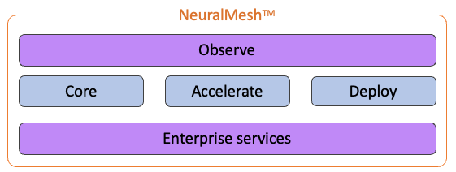
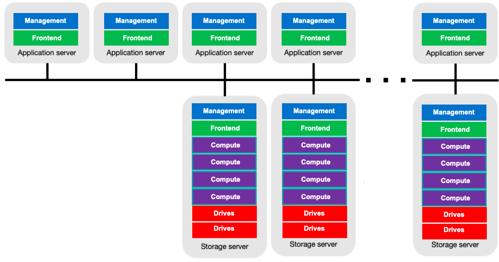

# Introduction

## Overview

NeuralMesh™ by WEKA is a software-only, high-performance, container-native storage system built for AI and data-intensive workloads at scale. It delivers low-latency, high-throughput data access with a microservices-based architecture that scales linearly and becomes more efficient as system size grows.

NeuralMesh redefines storage solutions by eliminating the performance bottlenecks inherent in legacy architectures. Built entirely from scratch as a fully distributed parallel filesystem, it runs on standard x86 and ARM infrastructures across on-premises, public cloud, and hybrid cloud environments without the need for custom hardware configurations. This software-only approach allows seamless integration of technological advancements without disruptive upgrades.

The design philosophy behind NeuralMesh was to create a single storage architecture that delivers the performance of all-flash arrays, the simplicity and feature set of Network-Attached Storage (NAS), and the scalability and economics of the cloud in a single unified system.

Use cases span demanding environments requiring shareable storage with low-latency, high-performance, and cloud scalability, including:

* AI/ML Inferencing and Training
* Agentic AI
* Life Sciences (genomics, Cryo-EM, pharmacometrics)
* Financial Trading
* Risk Analysis
* Engineering DevOps
* EDA
* Media Rendering
* Industrial/CAE (including computational chemistry and quantum chemistry simulations)
* HPC (tightly-coupled workloads)
* HTC (high throughput computing for loosely-coupled workloads, grid computing, and batch jobs)
* GPU pipeline acceleration.

By leveraging existing technologies in new ways and augmenting them with engineering innovations, NeuralMesh delivers a more powerful and simpler solution that traditionally would have required several disparate storage systems. The resulting software solution delivers high performance for all workloads—big and small files, reads and writes, random, sequential, and metadata-heavy operations. For example, before a read or write can happen, a file must be opened—and this open operation is a metadata operation that NeuralMesh handles efficiently alongside data operations.

NeuralMesh leverages NVMe Flash for the highest performance file services and integrates seamlessly with object storage, combining near memory-like flash performance with cost-effective economics. This transparent integration extends the namespace, enabling use cases like archiving and data protection without requiring manual data migration, external tools, or complex scripting. An intuitive graphical user interface allows a single administrator to manage exabytes of data quickly and easily without specialized storage training.

Benefits include high performance across all IO profiles, linear scalability, robust security, hybrid cloud support, private/public cloud backup, and cost-effective flash-object storage combination. NeuralMesh ensures a cloud-like experience, seamlessly transitioning between on-premises and cloud environments.

### NeuralMesh architecture components

NeuralMesh is composed of containerized microservices running within a Linux container (LXC), managed through the Kubernetes Operator. The system is organized into five key architectural components working in unison:

**Core – distributed, resilient, and self-optimizing:** The foundation that intelligently distributes data and metadata across the system, automatically balancing I/O to prevent hotspots. With built-in auto-healing, auto-scaling, and rapid rebuild capabilities, Core ensures high availability and durability at petabyte scale and beyond.

**Accelerate – consistent high-performance data access:** Establishes ultra-low latency, direct paths between compute and data by distributing both data and metadata across the entire system. This eliminates performance bottlenecks, ensures linear scalability, and maximizes GPU utilization.

**Deploy – run anywhere, scale everywhere:** Ensures the data layer can go wherever AI runs, whether building AI Factories on bare metal, deploying across multi-cloud environments, or scaling inference at the edge, with full architectural consistency. NeuralMesh can be deployed as dedicated storage servers or with NeuralMesh™ Axon™, which runs directly on GPU servers to leverage unused CPU cores and NVMe drives, eliminating external storage requirements while reducing footprint and power consumption.

**Enterprise services – secure, optimized, and feature-rich:** Delivers advanced security, encryption, data protection, and data management features, including performance-enhancing capabilities like zero-copy and zero-tuning data access.

**Observe – intelligent, scalable observability:** Provides deep, real-time insight into system performance, I/O behavior, and resource utilization for proactive issue resolution and efficient optimization.

<figure><figcaption>
The NeuralMesh architecture components
</figcaption></figure>

### NeuralMesh software-based storage architecture

The system comprises the following software components:

* **Frontend (FE) processes:** Manage multi-protocol connectivity for POSIX, NFS, SMB, and S3 client access, and handle I/O communication to compute and drive processes
* **Compute processes:** Manage data distribution, data protection, filesystem metadata services, clustering, and tiering
* **Drive processes:** Transform SSDs into efficient networked devices, managing I/O to and from physical drives
* **Management processes:** Manage events, CLI, statistics, and system monitoring
* **Telemetry processes:** Handle auditing and logging

By running in user space within Linux containers and bypassing the kernel, NeuralMesh achieves faster, lower-latency performance that is portable across bare-metal, VM, containerized, and cloud environments. Efficient resource consumption minimizes latency and optimizes CPU usage, offering flexibility in shared or dedicated environments.

<figure><figcaption>
NeuralMesh software-based storage architecture
</figcaption></figure>

NeuralMesh's design departs from traditional NAS solutions by introducing multiple filesystems within a global namespace that share the same physical resources. Each filesystem has its unique identity, allowing customization of snapshot policies, tiering, role-based access control (RBAC), quota management, and more. Unlike other solutions, filesystem capacity adjustments are dynamic, enhancing scalability without disrupting I/O.

NeuralMesh offers a robust, distributed, and highly scalable storage solution, allowing multiple application servers to access shared filesystems efficiently with strong consistency and full POSIX compliance.

**Related information**

[NeuralMesh by WEKA Architecture White Paper](https://www.weka.io/resources/white-paper/wekaio-architectural-whitepaper/)

### NeuralMesh Axon

NeuralMesh Axon is the specialized converged deployment mode engineered for large-scale AI and agentic workloads. By co-locating storage and compute services directly on GPU servers, Axon leverages unused CPU cores and local NVMe drives to eliminate external storage footprints. This configuration is optimized for microsecond-level latency and massive throughput, ensuring high performance for distributed GPU environments.

**Related information**

[neuralmesh-axon-overview.md](../neuralmesh-axon/neuralmesh-axon-overview.md "mention")

### Standard converged deployment

In addition to the AI-optimized NeuralMesh Axon, the system offers a standard converged deployment configuration for general-purpose workloads. This option is ideal for environments that require the full breadth of NeuralMesh connectivity features, including NFS, SMB, and S3 protocols. which are not available in the specialized Axon configuration.

In this configuration, NeuralMesh clients installed on application servers access the storage cluster while simultaneously hosting backend processes and local SSDs. These backend processes function collectively as a single, distributed, and scalable filesystem that shares the same physical infrastructure as the user applications.

**Key considerations**

* **Resource efficiency:** Combining storage and compute maximizes infrastructure utilization.
* **Flexibility:** The cluster can be heterogeneous, comprising some servers with both storage processes and clients, and others with clients only.
* **Availability and durability:** Even in the event of an application server reboot or failure, the system's robust N+2 and N+4 protection schemes seamlessly maintain data availability and durability. With RAFT-9 support, the architecture can tolerate up to 4 concurrent node failures without losing cluster availability, ensuring that the co-located storage backend remains resilient without disrupting operations.

This deployment mode mirrors the functionality of the standard dedicated architecture, delivering the same robust features for data protection, failure domains, and linear scalability.

***

## NeuralMesh system functionality features

NeuralMesh offers a range of powerful functionalities designed to enhance data protection, scalability, and efficiency, making it a versatile solution for various storage requirements.

### Protection

NeuralMesh employs N+2 or N+4 data protection, ensuring data protection even in the face of concurrent drive or backend failures. This distributed protection scheme is determined during cluster formation and can vary, offering configurations starting from 5+2 up to 16+4 for larger clusters. The system protects data at the failure domain level, typically a single server, with data broken into 4KB chunks aligned with NVMe SSDs and distributed across failure domains.

### Distributed network scheme

NeuralMesh incorporates an any-to-any protection scheme that ensures rapid recovery of data in the event of a backend failure. Unlike traditional storage architectures where redundancy is established across backend servers, NeuralMesh leverages distributed data stripes to protect one another within the entire cluster of backends.

**How it works:**

**Data recovery process:** If a backend within the cluster experiences a failure, NeuralMesh initiates a rebuilding process using all other operational backends. These healthy backends work collaboratively to recreate the data that originally resided on the failed backend. Importantly, all this occurs in parallel, with multiple backends simultaneously reading and writing data.

**Speed of rebuild:** This approach results in a speedy rebuild process. In traditional storage setups, only a small subset of backends or drives actively participate in rebuilding, often leading to slow recovery. In contrast, with NeuralMesh, all but the failed backend are actively involved, ensuring swift recovery and minimal downtime.

**Scalability benefits:** The advantages of this distributed network scheme become even more apparent as the cluster size grows. In larger clusters, the rebuild process is further accelerated. The highly randomized data placement methodology means that as cluster size grows, the probability of any two failure domains sharing a chunk of the same data stripe goes down exponentially, making NeuralMesh more resilient as it scales—an ideal choice for organizations handling substantial data volumes without sacrificing data availability.

In summary, NeuralMesh's distributed network scheme transforms data recovery by involving all available backends in the rebuild process, ensuring speedy and efficient recovery. This efficiency scales with larger clusters, making it a robust and scalable solution for data storage and protection.

### Efficient component replacement

In NeuralMesh, a virtual hot spare is configured within the cluster to provide the additional capacity needed for full recovery after a rebuild across the entire cluster. This differs from traditional approaches where specific physical components are designated as hot spares. For instance, in a 100-backend cluster, sufficient capacity is allocated to rebuild the data and restore full redundancy even after two failures. Depending on the protection policy and cluster size, the system can withstand additional failures.

This strategy for replacing failed components does not compromise system reliability. In the event of a system failure, there's no immediate need to physically replace a failed component to recreate the data. Instead, data is promptly regenerated, while replacing the failed component with a working one is a background process.

### Enhanced fault tolerance with failure domains

In NeuralMesh, failure domains are groups of backends that could fail due to a single underlying issue. For instance, if all servers within a rack rely on a single power circuit or connect through a single ToR switch, that entire rack can be considered a failure domain. Imagine a scenario with ten racks, each containing five NeuralMesh backends, resulting in a cluster of 50 backends.

To enhance fault tolerance, you can configure a protection scheme, such as 6+2 protection, during cluster setup. This makes NeuralMesh aware of these possible failure domains and creates a protection stripe across the racks. This means the 6+2 stripe is distributed across different racks, ensuring that the system remains operational even in case of a complete rack failure, preventing data loss.

It's important to note that the stripe width must be less than or equal to the count of failure domains. For instance, if there are ten racks and one rack represents a single point of failure, having a 16+4 cluster protection is not feasible. Therefore, the level of protection and support for failure domains depends on the stripe width and the chosen protection scheme.

### Prioritized data rebuild process

In the event of a failure in NeuralMesh, the data recovery process begins by reading all affected data stripes, reconstructing the lost data, and restoring full protection. If multiple failures occur, the affected stripes can be categorized as follows:

* Stripes unaffected by any of the failed components, requiring no action
* Stripes affected by one of the failed components
* Stripes affected by multiple failed components

Typically, the number of stripes affected by multiple failed components is significantly smaller than those affected by a single failed component. However, if any of these multi-affected stripes remain unrecovered, additional failures could lead to data loss.

To mitigate this risk, NeuralMesh employs a prioritized rebuild process. The system first restores stripes affected by the greatest number of failed components, as these are fewer in number and can be recovered quickly. Once these high-risk stripes are rebuilt, the system proceeds with restoring stripes impacted by fewer failures. This structured approach ensures that the probability of data loss remains low while maintaining system performance and availability.

### Seamless distribution, scaling, and enhanced performance

In NeuralMesh, every client installed on an application server directly connects to the relevant backends that store the required data. There's no intermediary backend that forwards access requests. Each NeuralMesh client maintains a synchronized map specifying which backend holds specific data types, creating a unified configuration shared by all clients and backends.

When a NeuralMesh client attempts to access a particular file or offset in a file, a cryptographic hash function guides it to the appropriate backend containing the needed data. This unique mechanism enables NeuralMesh to achieve linear performance growth, synchronizing scaling size with scaling performance for remarkable efficiency.

For instance, when new backends are added to double the cluster's size, the system instantly redistributes part of the filesystem data between the backends, resulting in an immediate performance increase. Complete data redistribution is unnecessary even in modest cluster growths, such as moving from 100 to 110 backends. Only a fraction (10% in this example) of the existing data is copied to the new backends, ensuring a balanced distribution and active participation of all backends in read operations.

The speed of these seamless operations depends on the capacity of the backends and network bandwidth. Importantly, ongoing operations remain unaffected, and the system's performance improves as data redistribution occurs. The finalization of the redistribution process optimizes both capacity and performance, making NeuralMesh an ideal choice for scalable and high-performance storage solutions.

### Efficient data reduction

NeuralMesh offers a cluster-wide data reduction feature that can be activated for individual filesystems. This capability employs block-variable differential compression and advanced similarity-based deduplication techniques across all filesystems to significantly reduce the storage capacity required for user data, resulting in substantial cost savings.

The effectiveness of the compression ratio depends on the specific workload. It is particularly efficient when applied to text-based data, large-scale unstructured datasets, log analysis, databases, code repositories, sensor data, and AI workloads. NeuralMesh's real-time compression utilizes dynamic dictionaries and similarity hashes to deliver efficient, low-overhead data processing, achieving compression ratios up to 8x for workloads like EDA and 10x for AI Inferencing, while maintaining consistent performance with minimal latency impact.
