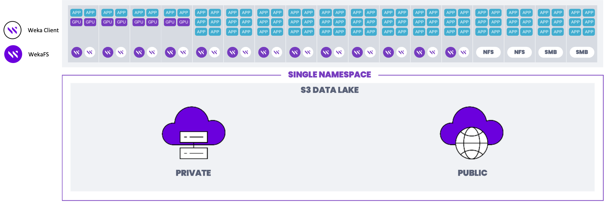

# Converged WEKA system deployment

The WEKA system offers a converged deployment configuration as an alternative to the standard setup. In this configuration, hundreds of application servers running user applications are equipped with WEKA clients, allowing them to access the WEKA cluster.

Unlike the standard deployment that dedicates specific servers to WEKA backends, the converged setup involves installing a WEKA client on each application server. Additionally, one or more SSDs and backend processes (WekaFS) are integrated into the existing application servers.

The WEKA backend processes function collectively as a single, distributed, and scalable filesystem, leveraging the local SSDs. This filesystem is accessible to the application servers, much like in the standard WEKA system deployment. The critical distinction is that, in this configuration, WEKA backends share the same physical infrastructure as the application servers.

<figure><figcaption>
WEKA system in converged mode with compute and storage on the same infrastructure
</figcaption></figure>

This blend of storage and computing capabilities enhances overall performance and resource usage. However, unlike the standard deployment, where an application server failure does not impact other backends, the converged setup is affected if an application server is rebooted or experiences a failure. The N+2 (or N+4) scheme still protects the cluster and can tolerate two concurrent failures. As a result, converged WEKA deployments require more careful integration and detailed coordination between computational and storage management practices.

In all other respects, this configuration mirrors the standard WEKA system, offering the same functionality features for protection, redundancy, failed component replacement, failure domains, prioritized data rebuilds, and seamless distribution, scale, and performance. Some servers may house a WEKA backend process and a local SSD, while others may have WEKA clients only. This allows for a cluster of application servers with a mix of WEKA software and WEKA clients, delivering a flexible solution.
