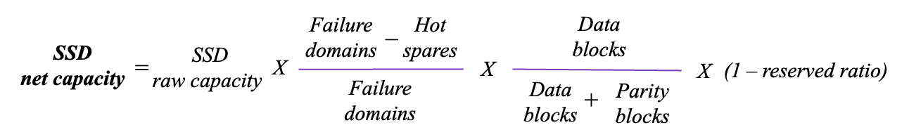
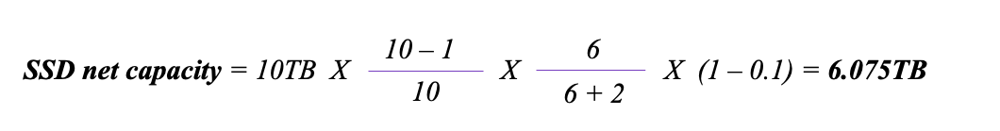
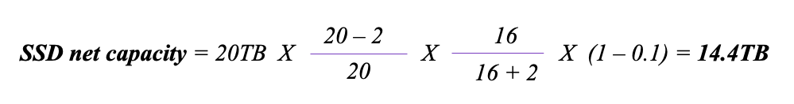
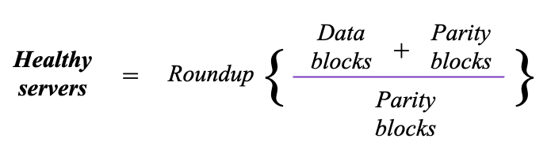
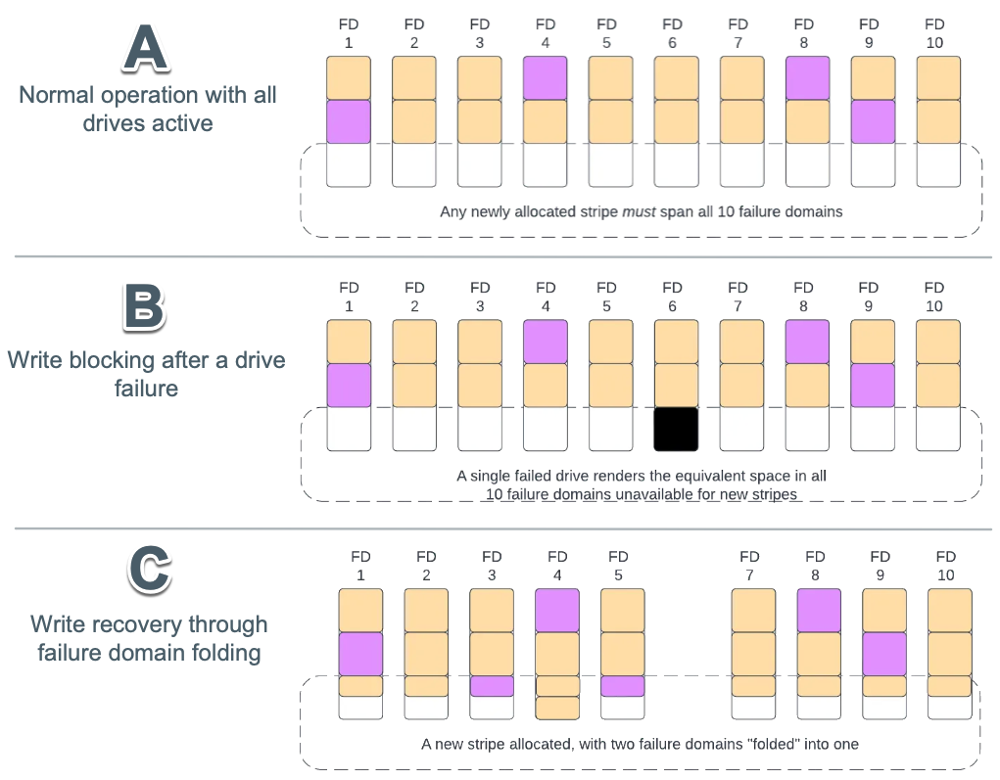

# Cluster capacity and redundancy management

Effective cluster capacity and redundancy management are crucial for ensuring data protection, availability, and optimal performance in WEKA systems. This involves understanding key capacity metrics, redundancy configurations, and the system's mechanisms for handling failures.

## Key capacity terms

Understanding the terminology related to storage capacity is fundamental:

* **Raw capacity**: This represents the total physical storage capacity of all SSDs assigned to a WEKA cluster. For example, if a cluster has 10 SSDs, each with 1 terabyte of capacity, the raw capacity is 10 terabytes. This figure automatically adjusts when more servers or SSDs are integrated into the cluster.
* **Net (usable) capacity**: This is the actual space available on the SSDs for storing user data. The net capacity is derived from the raw capacity and is influenced by several factors:
  * The chosen stripe width and protection level, which dedicate some capacity to system protection.
  * The allocation for hot spares, reserved for redundancy and rebuilds.
  * The WEKA cluster reserved capacity, allocated for internal system operations.
* **Provisioned capacity**: This refers to the total capacity that has been assigned to filesystems within the WEKA cluster. It includes capacity from both SSDs and any configured object stores.
* **Available capacity**: This is the remaining net capacity that can be used to allocate additional capacity to existing filesystems and create new filesystems . It is calculated by subtracting the provisioned capacity from the net capacity.

## Redundancy and protection levels

WEKA employs a distributed RAID system that supports a range of redundancy configurations. These are based on a **D+P model**, where D represents the number of data blocks and P represents the number of parity blocks. Common configurations are denoted as N+2, N+3, or N+4, where N is the number of data blocks. A critical rule is that the number of data blocks must always be greater than the number of parity blocks (for example, a 3+3 configuration is not allowed).

The selection of an appropriate redundancy level is a balance between fault tolerance, usable storage capacity, and system performance:

* **N+2**: This is the recommended level for most environments, providing a standard degree of fault tolerance. A system with protection level 2 can survive up to 2 simultaneous drive or server failures.
* **N+3**: This level offers increased data protection and is suitable for environments with higher availability requirements. A system with protection level 3 can survive up to 3 simultaneous drive or 2 simultaneous server failures.
* **N+4**: Designed for very large-scale clusters (typically 100+ backend servers) or for scenarios involving critical data that demands maximum redundancy. Protection level 4 can withstand up to 4 simultaneous drive failures or 2 simultaneous server failures.

Higher protection levels inherently provide better data durability and availability. However, they also consume more raw storage space for parity blocks and can potentially impact system performance due to the additional processing.

The protection level for a WEKA cluster is determined at the time of its formation and **cannot be changed later**. If no specific protection level is configured, the system defaults to protection level 2.

## Stripe width

**Stripe width** refers to the total number of blocks, both data and parity, that constitute a common protection set. In a WEKA cluster, the stripe width can range from 5 to 20 blocks. This total is composed of 3 to 16 data blocks and 2 to 4 parity blocks. For instance, a stripe width of 18 could represent a configuration of 16 data blocks and 2 parity blocks (16+2).

WEKA uses a **distributed any-to-any protection** scheme. This means that instead of data and parity blocks being confined to fixed protection groups, for example, a specific set of drives, they are distributed across multiple servers in the cluster. For example, in a configuration with a stripe width of 8 (6 data blocks and 2 parity blocks), these 8 blocks are spread across various servers to enhance resilience.

Like the protection level, the stripe width is also determined during the initial cluster formation and **cannot be altered subsequently**. The stripe width has a direct impact on both system performance (especially write throughput) and the usable storage capacity. Larger stripe widths generally improve write throughput because they reduce the proportion of parity overhead in write operations. This is particularly beneficial for high-ingest workloads, such as initial data loading or applications where most of the work involves writing new data.

## Hot spare capacity

WEKA clusters proactively reserve a portion of the total storage space as **virtual hot spare capacity** to ensure that resources are immediately available for data rebuilds in the event of component failures. By default, WEKA allocates 1/N of the total space for this purpose. For example, a 3+2 redundancy configuration is effectively deployed as 3+2+1, meaning one-sixth of the cluster's capacity is reserved as hot spare.

The hot spare capacity represents the number of failure domains the system can afford to lose and still successfully perform a complete data rebuild while maintaining the system's net capacity. All failure domains in the cluster actively contribute to data storage, and this hot spare capacity is evenly distributed among them.

If not explicitly configured by the administrator, the hot spare value is automatically set to 1. While a higher hot spare count provides greater flexibility for IT maintenance and hardware replacements, it also necessitates additional hardware to achieve the same net usable capacity.

## WEKA cluster reserved capacity ratio

After accounting for the capacity dedicated to data protection (parity) and hot spares, an additional **10 percent** of the remaining capacity is reserved for WEKA cluster internal use.&#x20;

## Failure domains

A **failure domain** is defined as a set of WEKA servers that are susceptible to simultaneous failure due to a single root cause. This could be, for example, a shared power circuit or a common network switch malfunction.

A WEKA cluster can be configured with either:

* **Explicit failure domains**: In this setup, blocks that provide mutual protection for each other (i.e., data and its corresponding parity) are deliberately distributed across distinct, administrator-defined failure domains.
* **Implicit failure domains**: In this configuration, data and parity blocks are distributed across multiple servers, and each server is implicitly considered a separate failure domain. Additional failure domains and servers can be integrated into existing or new failure domains.


The documentation generally assumes a homogeneous WEKA system deployment, meaning an equal number of servers and identical SSD capacities per server in each failure domain. For guidance on heterogeneous configurations, contact the [Customer Success Team](../support/getting-support-for-your-weka-system.md#contact-customer-success-team).


## SSD net storage capacity calculation

The formula for calculating the SSD net storage capacity is:

<figure><figcaption></figcaption></figure>

**Examples**:

**Scenario 1**: A homogeneous system of 10 servers, each with 1 terabyte of raw SSD capacity (total 10TB raw capacity). The system is configured with 1 hot spare and a protection scheme of 6+2 (6 data blocks, 2 parity blocks).

<figure><figcaption></figcaption></figure>

**Scenario 2**: A homogeneous system of 20 servers, each with 1 terabyte of raw SSD capacity (total 20TB raw capacity). The system is configured with 2 hot spares and a protection scheme of 16+2 (16 data blocks, 2 parity blocks).

<figure><figcaption></figcaption></figure>

## Performance and resilience during failures

### **Data rebuilds**

When a component like a drive or server fails, WEKA initiates a rebuild process to reconstruct the missing data. Rebuild operations are primarily **read-intensive**, as the system reads data from the remaining drives in the affected stripes to reconstruct the lost information.

While read performance may experience a slight degradation during this process, **write performance generally remains unaffected**, as the system can continue writing to the available backend servers.

A critical optimization in WEKA's rebuild process is its behavior when a failed component comes back online. If a failed drive or server returns to an operational state _after_ a rebuild has commenced, the rebuild process is **automatically aborted**.

This intelligent approach prevents unnecessary data movement and allows the system to quickly restore normal operations, especially in cases of transient failures (for example, servers returning from a brief maintenance window). This significantly differentiates WEKA from traditional systems that often continue lengthy rebuild processes even after the underlying fault has been resolved.

### **Resilience to serial failures**

Beyond the configured simultaneous failure protection (N+2, N+3, or N+4), a WEKA cluster also exhibits resilience to [**serial failures**](#user-content-fn-1)[^1] of additional failure domains. This means that as long as each data rebuild operation completes successfully and there is sufficient free NVMe capacity in the cluster, the system can tolerate subsequent individual server failures.

For example, consider a cluster of 20 servers with a stripe width of 18 (16+2). After successfully rebuilding from a simultaneous failure of 2 servers, the cluster is still resilient to two additional simultaneous server failures. If further serial server failures occur, the system attempts to rebuild its data stripes using the remaining healthy servers to maintain the required stripe width (for example, 18).

This process can continue, subject to sufficient NVMe space, until a lower limit of healthy servers is reached (for example, 9 servers in the 16+2 example). Failures beyond this critical threshold will result in the filesystem going offline.

In the event of serial server failures coupled with insufficient NVMe capacity to complete rebuilds, the cluster attempts to **tier data** that currently resides on NVMe out to its configured object stores. This is called [**backpressure mode**](#user-content-fn-2)[^2] where the tiering does not consider the age of the data (unlike normal, orderly tiering) but instead tiers data in an approximately random fashion. This process prioritizes data integrity by offloading data to an object store when NVMe available capacity is critically low.

### Minimum required healthy servers

The stripe data width and the protection level (number of data and parity blocks) determine the minimum number of healthy servers required for the cluster to remain operational. This can be represented by the following formula:

<figure><figcaption></figcaption></figure>

**Examples:**

| Stripe data width + protection level | Minimum required healthy servers |
| ------------------------------------ | -------------------------------- |
| 5+2                                  | 4                                |
| 16+2                                 | 9                                |
| 5+4                                  | 3                                |
| 16+4                                 | 5                                |

### Failure domain folding

In scenarios where hardware failures persist and components are not replaced promptly, WEKA employs a process called **failure domain folding** to maintain write availability. This process temporarily relaxes the standard requirement that each RAID stripe must span only distinct failure domains (for example, one block per backend storage server within a stripe).

By allowing a single failure domain to effectively appear multiple times within a newly allocated stripe, the system can continue to allocate new stripes and accept write operations even when in a degraded state.

Failure domain folding is automatically triggered when the number of active (healthy) failure domains becomes insufficient to satisfy the original stripe width requirement. This typically occurs due to server deactivation or the loss of multiple drives. This adaptive approach ensures that the system can remain operational and continue to accept writes during extended fault conditions, without necessitating immediate hardware replacement.

The process can be visualized in three stages:

1. **Stage A: Normal operation (all drives active)**: In the initial state, all backend storage servers are operational. Each server is treated as a distinct failure domain. RAID stripes, consisting of data (yellow blocks) and parity (purple blocks), span horizontally across all available failure domains. New stripe allocations proceed normally, utilizing free space across all failure domains. The system is configured with hot spare capacity (equivalent to two full servers) allocated across the system.
2. **Stage B: write blocking after a drive failure**: When a single drive fails, any new stripe that must span all failure domains can no longer be allocated if any one domain lacks sufficient space due to the failure. Even though only one drive has failed, this strict allocation requirement can effectively block new writes. This results in a disproportionate loss of writable capacity relative to the actual size of the failure, particularly noticeable in systems with fewer drives per server.
3. **Stage C: Write recovery through failure domain folding**: To mitigate the blocked write condition, the affected storage server (failure domain) can be manually deactivated. This allows WEKA to apply failure domain folding. The system relaxes the one-domain-per-stripe rule, permitting the reuse of the same failure domain within a newly allocated stripe. This mechanism restores write capability without requiring immediate hardware replacement, ensuring continued system operation under degraded conditions.

<figure><figcaption>
Failure domain in action (example)
</figcaption></figure>

[^1]: **Serial failures:** Refers to a sequence where each data rebuild finishes before another server fails, ensuring one-at-a-time failure handling.

[^2]: Backpressure mode is an emergency response that helps a system continue functioning by offloading data to secondary storage when primary storage is insufficient.
