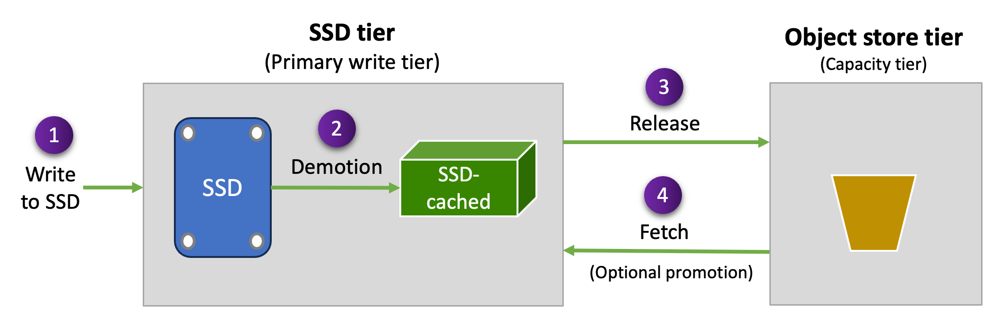

# Data lifecycle management overview

The WEKA system provides flexible storage architectures that balance performance and cost by managing data across different storage media. Understanding how WEKA handles data placement helps you configure systems that deliver the performance characteristics your workloads require while controlling storage costs.

## Storage media options in WEKA systems

WEKA systems use two types of storage media, each serving distinct purposes based on its performance and cost characteristics:

* **Solid-state drives (SSDs):** Form the foundation of every WEKA system. These locally attached drives provide the high performance and low latency that make WEKA suitable for demanding workloads. SSDs are a required component of any WEKA configuration, and they deliver the exceptional IOPS and throughput that applications depend on for fast data access.
* **Object store systems:** Represent the second storage tier available in WEKA. These systems connect to WEKA externally and can be cloud-based services like AWS S3 or Azure Blob Storage, or on-premises installations using various third-party solutions. Object stores trade some performance and add latency compared to SSDs, but they provide virtually unlimited capacity at significantly lower cost per terabyte than solid-state storage.

### Configuration options: SSD-only vs tiered systems

WEKA supports two fundamental configuration approaches that serve different use cases and priorities:

* SSD-only configurations
* Tiered configurations

#### SSD-only configurations

SSD-only configurations store all data exclusively on solid-state drives. This approach maximizes performance by maintaining all data on the fastest storage media available.

Workloads that demand consistent low latency and high throughput for all data access, regardless of data age or access frequency, benefit from SSD-only configurations. The trade-offs include capacity limitations, where the SSD investment bounds the total storage, and a higher cost per terabyte stored.

In SSD-only configurations, WEKA can optionally use object store for the Snap-To-Object feature. This feature maintains backup copies of snapshots in object store for disaster recovery while keeping all active data on SSDs for performance.

#### Tiered configurations

Tiered configurations combine SSDs and object store into an integrated system where WEKA automatically manages data placement between the two media.

This approach optimizes storage cost and efficiency. Newly created and frequently accessed data stays on SSDs for fast access, while older or rarely accessed data moves to object store. WEKA automatically identifies the appropriate tier for the data and transparently moves it between tiers as access patterns change.

Tiered configurations allow the provisioning of a much larger total filesystem capacity than the SSD investment alone supports. For example, a system can configure 25 TB of SSDs but create a 100 TB filesystem, while WEKA manages which 25 TB resides on SSDs based on access patterns and configured policies.

## Data management in tiered configurations

Understanding data placement in a tiered system clarifies how WEKA balances performance and cost.

### **Metadata residency**

Metadata resides exclusively on SSDs and is never tiered to the object store. This includes directory structures, file attributes, timestamps, permissions, and internal indexes used to locate data.

Maintaining metadata on SSD ensures that filesystem traversal operations, such as listing directories, verifying file existence, and reading attributes, consistently deliver SSD-level performance. This applies regardless of whether the associated file data resides on SSD or in the object store.

This design enables efficient navigation of very large filesystems, including environments containing billions of files, while preserving predictable and low-latency metadata access.

### **Write operations**

Write operations in tiered systems always target SSDs first. Creating new files, appending to existing files, or modifying content occurs at SSD speeds.

WEKA never writes directly to object store to avoid high latency in the write path. Instead, writes complete quickly on SSD, and the system manages the background process of copying data to object store based on configured policies.

### **Read operations and promotion**

Read operations access data from either storage tier based on the data’s current location:

* **SSD resident data:** If the data resides on SSD (for example, because it has not been tiered or remains cached), the read operation completes at SSD performance.
* **Object store resident data:** If the data exists only in the object store (OBS), WEKA retrieves the requested data and attempts to promote it to SSD. The scope of promotion depends on current system activity and resource availability. In optimal conditions, the entire dataset is promoted; however, promotion may be partial.

The system performs coordinated reads by serving all locally available data from the SSD while simultaneously fetching any missing segments from the object store. In this model, the SSD acts as a transparent cache layer. The system does not wait for full promotion to complete before using the local fragments to accelerate the request.

### Intelligent chunk-level management

WEKA optimizes storage efficiency and performance by managing data at a sub-file granularity. The system uses data chunks to distribute data across different SSDs and organize tiering. It tracks the storage tier and access patterns for each chunk independently.

#### Optimize large file handling

The chunk-level approach enhances large file management. For database files where applications frequently modify specific regions, the system retains active chunks on the SSD for fast access. It tiers unchanged portions to the object store. The application perceives a single consistent file, regardless of the storage tier where specific parts reside.

#### Prevent unnecessary data movement

Chunk-level granularity minimizes data movement. Modifying a specific section of a file, such as 10 MB within a 100 GB file, triggers a rewrite only for the modified chunks. These chunks restart their lifecycle on the SSD. Unchanged chunks maintain their current lifecycle on the SSD or object store. This approach avoids the resource cost of reprocessing the entire file when only a small portion changes.

### Data placement conditions

In a tiered configuration, data progresses through three placement conditions that reflect where it currently resides across storage tiers.

These conditions apply at the data-chunk level rather than the file level. As a result, a single file may simultaneously contain chunks in different placement conditions.

* **SSD-only:** Represents newly created or recently modified data residing exclusively in the SSD tier. This is the initial placement for all data entering the system before it is copied to the object store tier.
* **SSD-cached:** Represents data that exists in both the SSD tier and the object store tier. After tiering copies data to the object store, the SSD copy continues to provide low-latency access, while the object store copy provides durable capacity storage. Data may remain in this condition for extended periods to optimize performance.
* **Object-store-only:** Represents data that has been removed from the SSD tier after its retention eligibility or capacity-based release. The data resides solely in the object store tier. Accessing this data requires retrieval from the object store, which may introduce initial read latency.

Understanding these placement conditions clarifies system behavior:

* Data present in the SSD tier supports low-latency reads.
* Data residing only in the object store tier must be retrieved before access performance returns to SSD-level speeds.
* Tiering continuously evaluates and adjusts data placement according to policy and system conditions.

### Tiering processes

Tiering is the automated mechanism that moves data between storage tiers. In an object-store configuration, tiering governs how data transitions between the SSD tier and the object store tier over time.

Object-store tiering consists of four core processes:

1. Write to SSD
2. Demotion
3. Release
4. Fetch

These processes operate automatically based on configured policies and real-time system conditions.

#### Write to SSD

All new data is written to the SSD tier. This ensures low-latency write performance and immediate availability. After write completion, data becomes eligible for tiering operations.

#### Demotion

Demotion copies data from the SSD tier to the object store tier while retaining the SSD copy. After demotion completes, data exists in both tiers.

The Tiering Cue policy controls when demotion begins. It defines the delay between write completion and initiation of the copy operation to the object store. This delay helps avoid unnecessary object-store writes for data that may be modified or deleted shortly after creation.

Demotion runs as a background process and does not interrupt data access.

#### Release

Release removes the SSD copy after the object store copy has been successfully created. Following release, data resides only in the object store tier.

Release may occur due to:

* SSD capacity requirements, or
* Expiration of the configured retention period.

These triggers operate independently and may act together.

#### Fetch

Fetch occurs when data residing only in the object store tier is accessed. The system retrieves the requested data to satisfy the read operation.

Depending on system conditions and policy, the retrieved data may be placed back on the SSD tier. This placement is opportunistic and intended to improve subsequent access performance.

## Role of SSDs in tiered systems

In tiered configurations, SSDs perform three critical functions beyond storage: metadata processing, write staging, and read caching.

#### **Metadata processing**

Filesystem metadata operations, such as creating files, modifying attributes, and updating directory listings, involve frequent, small random read and write operations. SSDs excel at this workload pattern, whereas object store performs poorly.

WEKA stores all metadata on SSDs. This ensures fast filesystem navigation and file operations, regardless of the total data volume or its location.

#### **Write staging**

SSDs act as a low-latency staging area for write operations. Direct writing to object store imposes high latency on applications. To mitigate this, WEKA accepts all writes on SSDs, allowing them to complete at local speeds. The application proceeds immediately while the system handles the background task of copying data to object store. This approach delivers consistent write performance while leveraging cost-effective long-term storage.

#### **Read caching**

SSDs function as a read cache for object-stored data. When the system tiers data to the object store, it retains a cached copy on the SSD. To manage this cache, the system applies a Least Recently Used (LRU) policy. This ensures that the most recently accessed data remains on the high-performance SSD, while the system clears the least active data to free up space. This strategy supports a working set significantly larger than the physical SSD capacity.

## Capacity considerations in tiered filesystems

In tiered systems, distinguishing between total filesystem capacity and SSD capacity is essential for proper configuration and interpretation of system behavior. These two metrics serve different purposes.

**Capacity definitions**

* **Total filesystem capacity:** Represents the maximum amount of data the filesystem can hold across both tiers (SSD and object store). For example, a 100 TB filesystem can store up to 100 TB of data, distributed between the tiers based on policies and access patterns.
* **SSD capacity:** Represents the working space allocated for recently written or frequently accessed data, metadata, and caching. This is typically significantly smaller than the total filesystem capacity. For example, a system might allocate 25 TB of SSD capacity within a 100 TB filesystem, relying on object store for the remaining 75 TB.

**Role of reserved SSD capacity**

SSD space remains reserved for essential functions, even when not fully utilized for data storage. This reservation ensures resources are available for:

* **Metadata processing:** Storing directory structures and file attributes.
* **Write staging:** Accepting new writes at high speed before tiering.
* **Read caching:** Accommodating data promoted from object store upon access.

## Data lifecycle management policies

WEKA provides time-based policies to control data movement between tiers. These policies enable tuning the system for specific workload patterns and balancing performance against storage costs.

#### Drive retention period

The drive retention period specifies the duration data remains cached on the SSD after the system tiers it to the object store. This setting controls the depth of the SSD cache relative to data history.

* **Longer retention:** Keeps more data accessible at SSD speeds but requires more SSD capacity.
* **Shorter retention:** Reduces SSD requirements but increases the likelihood of fetching data from the object store upon access.

This setting serves as a target. If data is written faster than the SSD capacity can accommodate within the configured retention period, the system releases data earlier to prevent SSD exhaustion.

#### Tiering cue

The tiering cue determines the wait time before the system begins copying data from the SSD to the object store. This buffer accommodates data modification patterns. For workflows involving file edits over several hours or days, setting a tiering cue that spans the editing window prevents the repeated tiering of changing data.

The minimum tiering cue is one-third of the retention period.

#### **Policy configuration strategy**

Configure lifecycle policies at the filesystem group level to align with specific workload characteristics. Effective configuration requires analyzing data generation rates, access patterns, and available SSD capacity.

**Workload strategies**

* **Active processing:** Assign a long retention period to maintain working data on the SSD for high-performance access.
* **Archival storage:** Assign a short retention period for rarely accessed data to optimize SSD usage.

**Configuration examples**

* **Log files:** For log files processed within a month but retained permanently, set a one-month retention period. Verify that the SSD capacity is sufficient to cache one month of data.
* **Research data:** For research data analyzed for three months before archiving, set a three-month retention period. This keeps active data on the SSD for fast access while moving completed projects to the object store.

### Bypassing standard lifecycle policies

While time-based policies govern typical tiering behavior, the system provides mechanisms for situations that require immediate or policy-independent data movement.

#### **Snap to Object**

Snap to Object forces data to tier immediately to the object store tier.

When triggered, the system uploads:

* All associated metadata, and
* Any data that is not yet present in the object store.

Metadata stored in the object store is not accounted toward object-store capacity usage.

Snap to Object is commonly used in backup or rapid-persistence workflows where data must be made durable in the object store immediately, without waiting for standard tiering delays.

#### **Object-store direct mount (`obs_direct`)**

Object-store direct mount modifies the standard tiering flow for specific mount points.

*   **Write behavior:**&#x20;

    * Data is written to the SSD tier first.
    * It is immediately scheduled for upload to the object store tier.
    * After successful upload, the data is promptly released from SSD.

    This minimizes SSD residency time while preserving the system’s write-path integrity.
*   **Read behavior:**

    * Reads retrieve data directly from the object store tier.
    * Retrieved data is not promoted to the SSD tier.

    This mode is suitable for workflows such as large-scale data ingestion or bulk imports where SSD caching is not required and capacity efficiency is prioritized.

**Related topics**

[tiering.md](../weka-filesystems-and-object-stores/tiering.md "mention")

[snap-to-obj](../weka-filesystems-and-object-stores/snap-to-obj/ "mention")
