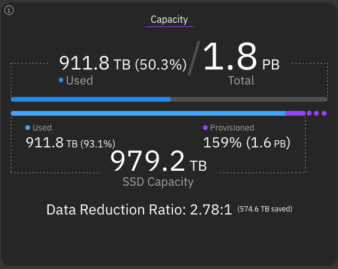
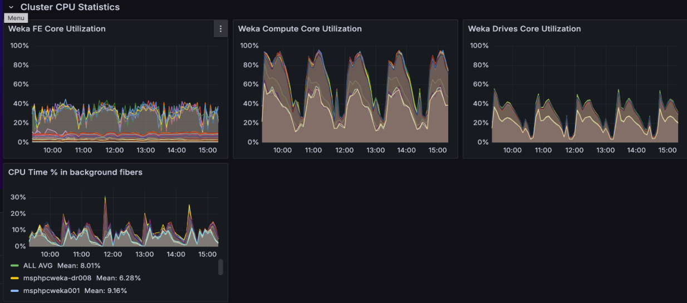
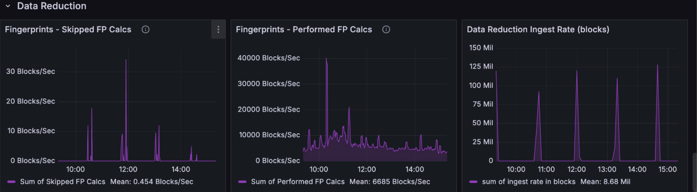

# Filesystems, object stores, and filesystem groups

## Storage entities overview

Filesystems, object stores, and filesystem groups define how WEKA organizes storage capacity, data placement, and policy. A filesystem presents data to applications. A filesystem group defines the shared capacity and tiering boundaries for its member filesystems. An object store extends capacity for tiered data and snapshot workflows.

* **Filesystem:** A logical storage namespace that distributes data across the cluster.
* **Object store:** An external storage tier that stores warm data and snapshots.
* **Filesystem group:** A shared policy boundary that controls how member filesystems use capacity and tiering.

Every filesystem belongs to one filesystem group. Tiered filesystems can attach object store buckets according to the policies and limits defined for that group.

### Thin provisioning **in** WEKA filesystems

Thin provisioning is a method of SSD capacity allocation where administrators define two key values for each filesystem:

* A minimum guaranteed capacity.
* A maximum capacity limit (which can virtually exceed the available physical SSD capacity).

The system automatically manages capacity between these bounds:

* When a filesystem exceeds its minimum capacity, it can grow up to the maximum capacity limit, provided physical SSD space is available.
* When data is deleted or transferred, unused space is automatically reclaimed and made available to other filesystems that need it.

This approach benefits several scenarios:

* **Tiered filesystems:** Available SSD capacity provides performance benefits and can be released to the object store when other filesystems need it.
* **Auto-scaling groups:** The filesystem's SSD capacity automatically expands and shrinks between the defined minimum and maximum values when using auto-scaling groups.
* **Filesystems separation per project:** Administrators can create separate filesystems for each project with defined minimum capacities. Each filesystem can grow beyond its minimum (up to its maximum) based on available physical SSD capacity, enabling efficient resource sharing when not all filesystems need their maximum capacity simultaneously.

### WEKA filesystem limits

* **Number of filesystems:** up to 1024
* **Number of files or directories:** Up to 6.4 trillion (6.4 \* 10^12)
* **Number of files in a single directory:** Up to 6.4 billion (6.4 \* 10^9)
* **Total capacity with object store:** Up to 14 EiB
* **Total SSD capacity:** Up to 1 EiB
* **File size:** Up to 4 PiB

### Data reduction **in** WEKA filesystems

Data reduction is a cluster-wide feature that you can activate for individual filesystems. This feature uses block-variable differential compression and advanced deduplication techniques across all enabled filesystems. The result is a significant reduction in the storage capacity required for user data, which can lead to substantial cost savings. The capacity savings from a data reduction-enabled filesystem are returned to the cluster, not to the filesystem itself.

The effectiveness of the data reduction ratio depends on the workload. It is particularly effective for text-based data, large-scale unstructured datasets, log analysis, databases, code repositories, and sensor data.

Data reduction applies only to user data, not metadata, on a per-filesystem basis.

For example, the image below shows a cluster with a total physical SSD capacity of 979.2 TB. Thanks to data reduction, the cluster achieves a Data Reduction Ratio of 2.78:1, which results in 574.6 TB of saved capacity. This saving allows the cluster to have 1.6 PB of provisioned space, which is 159% of the actual physical capacity.

<figure><figcaption>
Data reduction capacity saving
</figcaption></figure>

#### Prerequisites

To enable data reduction on a filesystem, the following conditions must be met:

* The filesystem is thin-provisioned.
* The filesystem is non-tiered.
* The filesystem is not encrypted.
* The cluster has a valid Data Efficiency Option (DEO) license.

#### How data reduction operates

Data reduction is a post-process, background activity with a lower priority than user I/O requests. When new data is written to a filesystem with data reduction enabled, it is initially stored uncompressed. The reduction process begins automatically as a background task once a sufficient amount of data accumulates.

The data reduction process during write involves the following tasks:

1. **Fingerprinting and ingestion:** As data is written, the system performs fingerprinting by calculating similarity hashes. A background ingest task then uses these hashes to find similar data blocks across all filesystems that have data reduction enabled. This technique, known as clusterization, operates at the 4K block level to identify similarities.
2. **Compression:** The system reads the similar and unique data blocks and compresses them. The newly compressed data is then written back to the filesystem.
3. **Defragmentation:** After data is successfully compressed, the original, uncompressed blocks are marked for deletion. A defragmentation process waits for a sufficient number of these blocks to be invalidated and then permanently deletes them, freeing up SSD capacity.

<figure><figcaption>
Data reduction process during write at a glance
</figcaption></figure>

The data reduction process during read involves decompressio&#x6E;**.** When a client reads compressed data, the system performs decompression inline as part of the read operation. This decompression is handled by the drive containers.

#### Performance monitoring

You can monitor the performance and impact of data reduction using a dedicated Grafana dashboard. This dashboard provides insights into the resources being used and the efficiency of the reduction process.

Key monitoring panels include:

* **CPU Time % in background fibers:** Shows the percentage of CPU capacity used by background tasks, including data reduction.
* **Data Reduction Ingest Rate:** Tracks the rate (in blocks) at which data is being ingested for reduction.
* **Fingerprints - Performed FP Calcs:** Displays the rate of fingerprint calculations being performed per second.
* **Fingerprints - Skipped FP Calcs:** Shows the rate of fingerprint calculations that were skipped. An increase in skipped calculations can indicate a high system load.

<figure><figcaption>
Cluster CPU statistics
</figcaption></figure>

<figure><figcaption>
Data reduction fingerprints and ingest rate
</figcaption></figure>

### Encrypted filesystems in WEKA

WEKA ensures security by offering encryption for data at rest (residing on SSD and object store) and data in transit. This security feature is activated by enabling the filesystem encryption option. The decision on whether a filesystem should be encrypted is crucial during the filesystem creation process.

To create encrypted filesystems, deploying a Key Management System (KMS) is imperative, reinforcing the protection of sensitive data.


Data encryption settings can only be configured during the initial creation of a filesystem, emphasizing the importance of making this decision from the beginning.


**Related topics**

[Manage KMS](../../security/kms-management/)

### Metadata limitations **in** WEKA filesystems

In addition to the capacity constraints, each filesystem in WEKA has specific limitations on metadata. The overall system-wide metadata cap depends on the SSD capacity allocated to the WEKA system and the RAM resources allocated to the WEKA system processes.

WEKA carefully tracks metadata units in RAM. If the metadata units approach the RAM limit, they are intelligently paged to the SSD, triggering alerts. This proactive measure allows administrators sufficient time to increase system resources while sustaining IO operations with minimal performance impact.

By default, the metadata limit linked to a filesystem correlates with the filesystem's SSD size. However, users have the flexibility to override this default by defining a filesystem-specific `max-files` parameter. This logical limit empowers administrators to regulate filesystem usage, providing the flexibility to update it as needed.

The cumulative metadata memory requirements across all filesystems can surpass the server’s RAM capacity. In potential impact scenarios, the system optimizes by paging the least recently used units to disk, ensuring operational continuity with minimal disruption.

#### Metadata units calculation 

Every metadata unit within the WEKA system demands 4 KB of SSD space (excluding tiered storage) and occupies 20 bytes of RAM.

Throughout this documentation, the restriction on metadata per filesystem is denoted as the `max-files` parameter. This parameter includes the files' count and respective sizes.

The following table outlines the requisite metadata units based on file size. These specifications apply to files stored on SSDs or tiered to object stores.

<table><thead><tr><th width="152.34501597463696">File size</th><th width="237">Number of metadata units</th><th>Example</th></tr></thead><tbody><tr><td>&#x3C; 0.5 MB</td><td>1</td><td>A filesystem containing 1 billion files, each sized at 64 KB, requires 1 billion metadata units.</td></tr><tr><td>0.5 MB - 1 MB</td><td>2</td><td>A filesystem containing 1 billion files, each sized at 750 KB, requires 2 billion metadata units.</td></tr><tr><td>> 1 MB</td><td>2 for the first 1 MB plus 1 per MB for the rest MBs</td><td><ul><li>A filesystem containing 1 million files, each sized at 129 MB, requires 130 million metadata units. This calculation includes 2 units for the first 1 MB and an additional unit per MB for the subsequent 128 MB.</li><li>A filesystem containing 10 million files, each sized at 1.5 MB, requires 30 million metadata units.</li><li>A filesystem containing 10 million files, each sized at 3 MB, requires 40 million metadata units.</li></ul></td></tr></tbody></table>


Each directory requires two metadata units instead of one for a small file.


**Related topics**

[#memory-resource-planning](../../planning-and-installation/bare-metal/planning-a-weka-system-installation.md#memory-resource-planning "mention")

### Filesystem Extended Attributes considerations

The maximum size for extended attributes (xattr) of a file or directory is 1024 bytes. This attribute space is used by Access Control Lists (ACLs) and Alternate Data Streams (ADS) within an SMB cluster and when configuring SELinux. When using Windows clients, named streams in smb-w are saved in the file’s xattr.

Given its finite capacity, exercise caution when using lengthy or complex ACLs and ADS on a WEKA filesystem.

When encountering a message indicating the file size exceeds the limit allowed and cannot be saved, carefully decide which data to retain. Strategic planning and selective use of ACLs and ADS contribute to optimizing performance and stability.

### Quality of Service (QoS)

Quality of Service (QoS) is a set of mechanisms that manages and prioritizes system resources, ensuring consistent performance and preventing any single entity from overwhelming cluster resources.

**QoS control levels**

WEKA provides multiple resource management layers to prevent noisy neighbors from impacting critical workloads:

* **Tenant level:** Administrators can configure the QoS after tenant creation. QoS ensures a specific tenant is capped at a defined performance threshold, regardless of how many filesystems the tenant owns.
* **Filesystem level:** Administrators can define QoS settings when adding or updating a filesystem. Use this to prioritize specific project or department workloads.
* **Client level:** Limits can be set at the client level through mount options, though the client's own network hardware may constrain these limits.

**Related topics**

[Multi-tenancy cluster-level administration](../../operation-guide/weka-native-multi-tenancy-management/multi-tenancy-cluster-level-administration.md#manage-tenant-quality-of-service)

[Manage filesystems using the CLI](../../weka-filesystems-and-object-stores/managing-filesystems/managing-filesystems-1.md#add-a-filesystem)

[Mount filesystems](../../weka-filesystems-and-object-stores/mounting-filesystems/#additional-mount-options-using-the-stateless-clients-feature)

**Performance parameters**

QoS is configured through two CLI parameters: one that limits the total number of I/O operations per second (IOPS), and one that limits bandwidth (throughput). Both parameters apply as aggregate limits across read and write operations, which cannot be restricted independently.

**Enforcement and throttling**

When a filesystem or tenant reaches its defined QoS limit, the system throttles traffic to keep it within the configured parameters.

* **Dynamic adjustment:** Setting a limit to `0` removes the cap, allowing unlimited performance based on available physical resources.
* **Hierarchical enforcement:** If a tenant and a filesystem both have QoS limits, the system enforces the more restrictive limit. For example, the total throughput of all filesystems within a tenant cannot exceed the tenant's overall QoS limit.

**Fair distribution**

When multiple clients or processes are throttled simultaneously, the system applies a fairness logic that divides available performance capacity equally among all active participants. This ensures that lower-demand processes receive their fair share of allocated bandwidth or IOPS, rather than distributing resources proportionally to demand.

**Considerations**

* **Bursting:** QoS supports bursting control, allowing a filesystem to temporarily exceed its defined limit. This is useful in scenarios where multiple clients start simultaneously and require short-term additional throughput.
* **Interface availability:** QoS settings are fully manageable through the CLI, but are not available in the WEKA GUI or the REST API.

## Object stores overview

Within the WEKA system, object stores are an optional external storage medium strategically designed to store warm data. These object stores, employed in tiered WEKA system configurations, can be cloud-based, located in the same location as the WEKA cluster, or at a remote location.

WEKA extends support for object stores, leveraging their capabilities for tiering (both tiering and local snapshots) and backup (snapshots only). Both tiering and backup functionalities can be concurrently used for the same filesystem, enhancing flexibility.

The optimal usage of object store buckets comes into play when a cost-effective data storage tier is imperative and traditional server-based SSDs prove insufficient in meeting the required price point.

An object store bucket definition comprises crucial components: the object store DNS name, bucket identifier, and access credentials. The bucket must remain dedicated to the WEKA system, ensuring exclusivity and security by prohibiting access from other applications.

Moreover, the connectivity between filesystems and object store buckets extends beyond essential storage. This connection proves invaluable in data lifecycle management and facilitates the innovative Snap-to-Object features, offering a holistic approach to efficient data handling within the WEKA system.

**Related topics**

[Manage object stores](../../weka-filesystems-and-object-stores/managing-object-stores/)

[Data lifecycle management overview](../data-storage.md)

[Snap-To-Object](../../weka-filesystems-and-object-stores/snap-to-obj/)

## Filesystem groups overview

Within the WEKA system, the organization of filesystems takes place through the creation of filesystem groups, with a maximum limit set at eight groups.

Each of these filesystem groups comes equipped with tiering control parameters. When filesystems are tiered and have associated object stores, the tiering policy remains consistent for all tiered filesystems residing within the same filesystem group. This unification ensures streamlined management and unified control over tiering strategies within the WEKA system.

**Related topics**

[Manage filesystem groups](../../weka-filesystems-and-object-stores/managing-filesystem-groups/)
