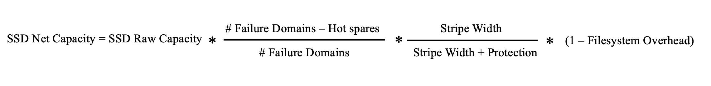

# SSD capacity management

## Raw capacity

Raw capacity is the total capacity of all SSDs assigned to a WEKA system cluster. For example, 10 SSDs of one terabyte each provide a total raw capacity of 10 terabytes. This represents the total capacity available for the WEKA system. This capacity automatically adjusts when more servers or SSDs are added.

## Net capacity

Net capacity is the space available for user data on the SSDs in a configured WEKA system. It is derived from the raw capacity minus the WEKA filesystem overheads for redundancy protection and other requirements. This capacity automatically adjusts when more servers or SSDs are added.

## Stripe width

The stripe width is the number of blocks within a common protection set, ranging from 3 to 16. The WEKA system employs distributed any-to-any protection. In a system with a stripe width of 8, many groups of 8 data units spread across various servers protect each other, rather than a fixed group of 8 servers forming a protection group.

The stripe width is set during cluster formation and cannot be changed. The choice of stripe width impacts performance and net capacity.

If not configured, the stripe width is automatically set to: #Failure Domains - Protection Level -1.

## Protection level

Protection level refers to the number of extra protection blocks added to each data stripe in your storage system. These blocks help protect your data against hardware failures. The protection levels available are:

* **Protection level 2**: Can survive 2 concurrent disk or server failures.
* **Protection level 4**: Can survive 4 concurrent disk failures or 2 concurrent server failures.

A higher protection level means better data durability and availability but requires more storage space and can affect performance.

**Key points:**

* **Durability**:
  * Higher protection levels offer better data protection.
  * Level 4 is more durable than level 2.
* **Availability**:
  * Ensures system availability during hardware failures.
  * Level 4 maintains availability through more extensive failures compared to level 2.
* **Space and performance**:
  * Higher protection levels use more storage space.
  * They can also slow down the system due to additional processing.
* **Configuration**:
  * The protection level is set during cluster formation and cannot be changed later.
  * If not configured, the system defaults to protection level 2.

### Resilience to serial failures

Beyond the +2 or +4 concurrent failure protection, a WEKA cluster is also resilient[^1] to [serial failures](#user-content-fn-2)[^2] of additional servers. Providing that there is enough free SSD capacity to complete each rebuild successfully, a cluster is resilient to an additional server failure, even if the failure would reduce the number of available servers below the stripe width.

#### **Example of failure resilience after rebuild completion**

Consider a cluster of 20 servers with a stripe width of 18 (16+2). After rebuilding from a concurrent failure of 2 servers, the cluster still resilient to two additional concurrent server failures.

In the event of subsequent server failures, the cluster rebuilds with the remaining healthy servers to support the stripe width of 18. Even if the number of healthy servers drops below 18, the system remains resilient to a single server failure until only 9 servers are left, as long as there is sufficient free SSD capacity and the rebuild completes between each server failure. Failures beyond this point result in the filesystem going offline.

#### Resilience level and minimum required healthy servers

The stripe width and protection level determine the minimum number of required healthy servers. This can be represented by the following formula:

$$
H = Roundup((D+P)/P)
$$

Where:

* _D_ is the data blocks in the stripe.
* _P_ is the protection blocks in the stripe.
* _H_ is the minimum number of healthy servers.

The following are a few examples:

<table><thead><tr><th width="282">Stripe width (D+P)</th><th>Minimum required healthy servers (H)</th></tr></thead><tbody><tr><td>5+2</td><td>4</td></tr><tr><td>16+2</td><td>9</td></tr><tr><td>5+4</td><td>3</td></tr><tr><td>16+4</td><td>5</td></tr></tbody></table>

## Failure domains (optional)

A failure domain is a set of WEKA servers susceptible to simultaneous failure due to a single root cause, such as a power circuit or network switch malfunction.

A cluster can be configured with either explicit or implicit failure domains:

* **Explicit failure domains:** In this setup, blocks that offer mutual protection are distributed across distinct failure domains.
* **Implicit failure domains:** Here, blocks are distributed across multiple servers, with each server considered a separate failure domain. Additional failure domains and servers can be integrated into existing or new failure domains.


This documentation assumes a homogeneous WEKA system deployment, meaning an equal number of servers and identical SSD capacities per server in each failure domain. For guidance on heterogeneous configurations, contact the [Customer Success Team](../support/getting-support-for-your-weka-system.md#contact-customer-success-team).


## Hot spare

A hot spare is reserved capacity designed to handle data rebuilds while maintaining the system’s net capacity, even in the event of failure domains being lost. It represents the number of failure domains the system can afford to lose and still perform a complete data rebuild successfully.

All failure domains actively contribute to data storage, and the hot spare capacity is evenly distributed among them. While a higher hot spare count requires additional hardware to maintain the same net capacity, it provides greater flexibility for IT maintenance and hardware replacements.


The default hot spare setting in a WEKA cluster is 1 for 6 failure domains and 2 for more⁠⁠. The hot spare can be configured during cluster formation and reconfigured anytime.


## WEKA filesystem overhead

After accounting for protection and hot spare capacity, only 90% of the remaining capacity is available as net user capacity, with the other 10% reserved for the WEKA filesystems. This is a fixed formula and cannot be configured.

## Provisioned capacity

Provisioned capacity is the total capacity assigned to filesystems, including both SSD and object store capacity.

## Available capacity

Available capacity is the total capacity used to allocate new filesystems, calculated as net capacity minus provisioned capacity.

## Deductions from raw capacity to obtain net storage capacity

The net capacity of the WEKA system is determined by making the following three deductions during configuration:

* **Protection level:** Storage capacity dedicated to system protection.
* **Hot spare(s):** Storage capacity reserved for redundancy and rebuilding following component failures.
* **WEKA filesystem overhead:** Storage capacity allocated to enhance overall performance.&#x20;

## SSD net storage capacity calculation

<figure><figcaption></figcaption></figure>

**Examples:**


**Scenario 1:** A homogeneous system of 10 servers, each with one terabyte of Raw SSD Capacity, one hot spare, and a protection scheme of 6+2.


$$
SSD Net Capacity = 10 TB * (10-1) / 10 * 6/(6+2) * 0.9 = 6.075 TB
$$


**Scenario 2:** A homogeneous system of 20 servers, each with one terabyte of Raw SSD Capacity, two hot spares, and a protection scheme of 16+2.


$$
SSD Net Capacity = 20 TB * (20-2) / 20 * 16/(16+2) * 0.9 = 14.4 TB
$$

[^1]: **Cluster resiliency**: A WEKA cluster with more hosts than the total protection stripe width returns to full redundancy once the rebuild completes.

[^2]: **Serial failures:** Refers to a sequence where each data rebuild finishes before another server fails, ensuring one-at-a-time failure handling.
