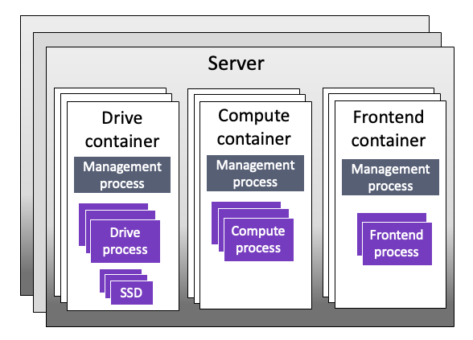

# Cluster architecture overview

## Cluster architecture basics

In the NeuralMesh system, servers operate as cluster members, each server hosting multiple containers. These containers run software instances, referred to as processes, that collaborate and communicate within the cluster to deliver robust and efficient storage services. This architecture ensures scalability and fault tolerance by distributing storage functionality across interconnected containers.

### Process types and core requirements

The system uses different types of processes, each dedicated to specific functions:

* **Drive processes**: A backend process that manages SSD drives and handle IO operations to drives. These processes are fundamental to storage operations and each requires a dedicated core to ensure optimal performance.
* **Compute processes:** A backend process that handles filesystems, cluster-level functions, and IO from clients. Each compute process requires a dedicated core to ensure consistent processing power for these critical operations.
* **Frontend processes**: A client process that manages POSIX client access and coordinates IO operations with compute and drive processes. Each frontend process requires a dedicated core to maintain responsive client interactions.
* **Management process**: A backend process that oversees overall cluster operations. It has lower resource demands and can share cores. The process uses kernel networking and unallocated OS-available cores.

## Multi-container backend (MCB) architecture

Each server implements a multi-container backend architecture where containers are specialized by process type: drive, compute, or frontend.

<figure><figcaption>
MCB architecture
</figcaption></figure>

## Benefits of MCB architecture

* **Non-Disruptive Upgrade (NDU) capabilities:**
  * Enables true non-disruptive upgrades where containers can run different software versions independently without system interruption
  * Supports individual container rollback without impacting cluster operations
  * Maintains continuous network control plane access throughout the upgrade process, ensuring uninterrupted client service
* **Optimized hardware utilization:**
  * Supports up to 512 cores per server
  * Multiple containers per process type
  * Flexible core allocation across containers
  * Up to 19 cores per container
* **Improved maintenance operations:**
  * Selective process management
  * Ability to maintain drive processes while stopping compute and frontend processes

## System limitations and specifications

### **Process limits**

* Total processes per cluster: 65,534 (includes all process types: management, drive, compute, and frontend).
* Maximum management processes: 32,767.
* Maximum drive processes: 62,244.

### **Server and container limits**

Each server has resource limits that affect how many containers it can run and how cores are allocated:

* Maximum cores per server: 512
* Maximum cores per container: 19
* Maximum containers of any type per server: 128
  * Within this total, the maximum frontend containers per server is 7.


When the cluster is deployed on Kubernetes as a multi-tenant solution, the limits above apply per tenant.

