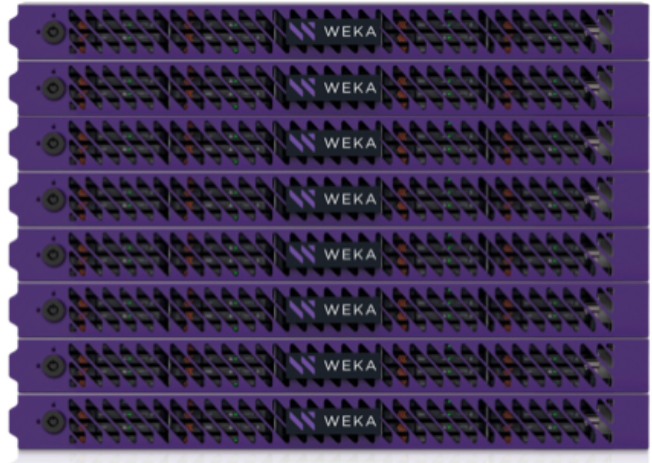

# WEKApod Data Platform Appliance overview

The WEKApod™ is a turnkey data platform appliance that is purpose-built as a high-performance datastore for NVIDIA DGX SuperPOD. Each appliance consists of pre-configured storage servers and software for simplified deployment and faster time to value.

It is powered by the WEKA Data Platform and supports NVMe and NVMe-oF technology (POSIX, RDMA, and TCP), Magnum IOTM GPUDirect Storage (GDS), NFS, S3, and SMB protocol. The WEKApod starts with a minimum of 8 severs and scales to hundreds of servers.

<figure><figcaption>
WEKApod overview
</figcaption></figure>

#### Purpose and benefits of the WEKA data platform appliance

The WEKApod appliance is designed to overcome traditional storage scaling and file sharing limitations, and it allows parallel file access to the same namespace through POSIX, NFS, SMB, S3, and Magnum IOTM GPUDirect Storage.

It provides a rich enterprise feature set, including local snapshots, automated tiering, self healing, private cloud multi-tenancy, backup, encryption, authentication, key management, user groups, quotas, and more.

The WEKApod’s exceptional performance density improves GPU and workload processing efficiencies, optimizes rack space utilization, and reduces idle energy consumption and carbon emissions, contributing to overall power savings and helping organizations meet their sustainability goals.

It also enables various hybrid cloud workflows, including bursting into the cloud, running workflows that span locations, and using the cloud to protect and archive data.

### Guide overview

This guide provides detailed instructions for setting up and managing the WEKApod Data Platform Appliance. It covers the following sections:

1. **WEKApod Data Platform Appliance overview** (this page)\
   An introduction to the WEKApod solution, highlighting its key features and benefits.
2. [server-overview.md](server-overview.md "mention")\
   A breakdown of the core WEKApod server components, including descriptions of the front and back panels.
3. [rack-installation.md](rack-installation.md "mention")\
   Step-by-step instructions on unpacking and installing the WEKApod system into a rack, including safety and regulatory information.
4. [setup.md](setup.md "mention")\
   An outline of the initial setup tasks and configuration, which will be carried out by the WEKA support team.
5. [support.md](support.md "mention")\
   A description of the WEKApod multi-tiered support system, providing customer assistance.

Each section guides you through key processes to ensure a smooth setup and operation of the WEKApod system. For detailed information, click on the relevant section link above.

**Related topics**

[about](../weka-system-overview/about/ "mention")

[Broken link](broken-reference "mention")

**Related information**

[The WEKApod Data Platform Appliance Datasheet](https://www.weka.io/resources/datasheet/the-wekapod-data-platform-appliance/)

[NVIDIA DGX SuperPOD Documentation](https://docs.nvidia.com/dgx-superpod/index.html#deployment-guides)
