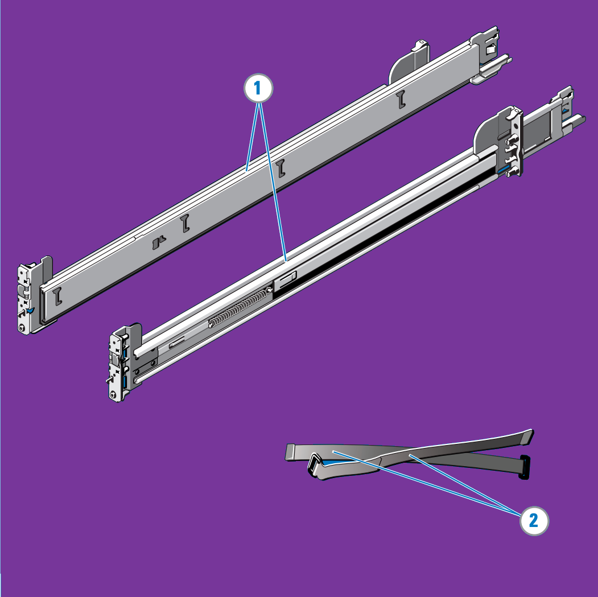
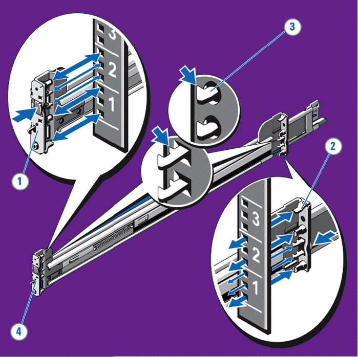
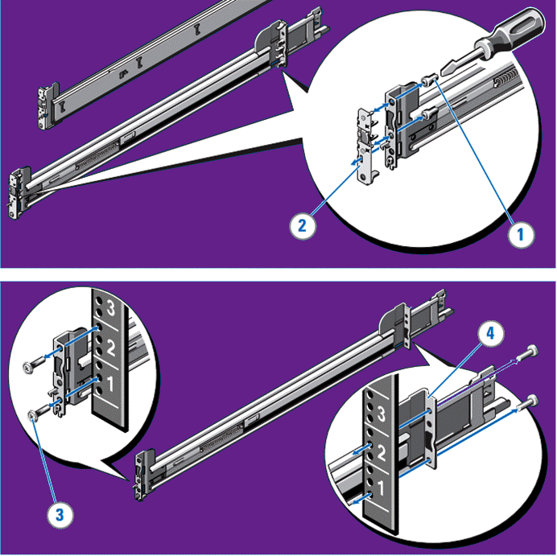
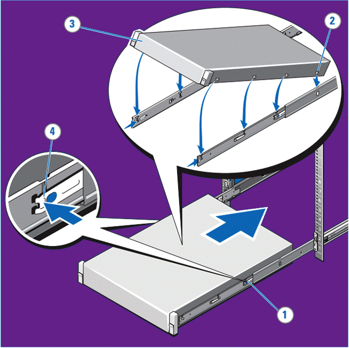
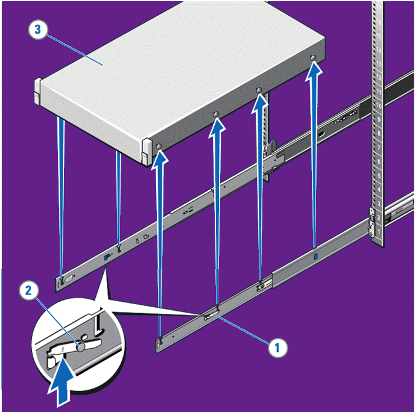
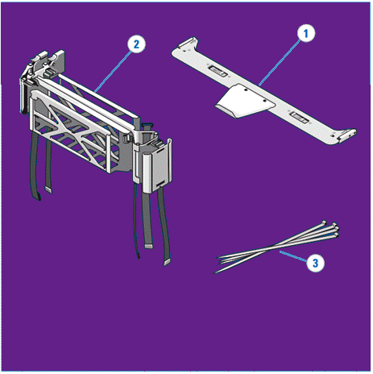
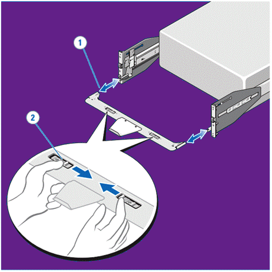
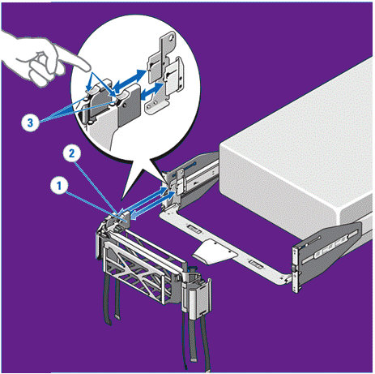
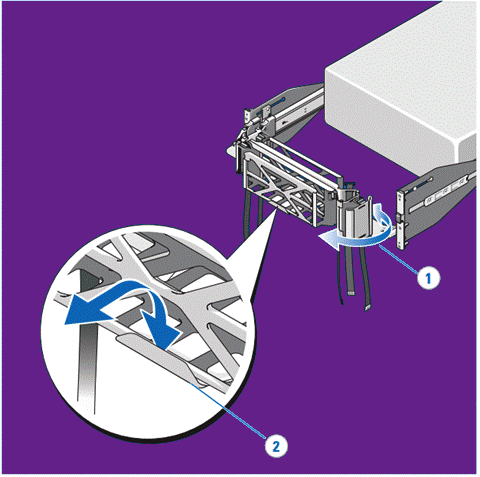
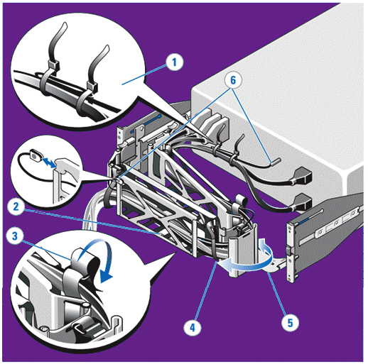

# Rack installation


Before you begin, read the **Enterprise Products Safety, Environmental, and Regulatory Information** attached below.



Enterprise Products Safety, Environmental, and Regulatory Information (world-wide)



Only trained service technicians are authorized to remove the system cover and access any components inside the system.


## Inspect packaging

1. **Examine packaging for damage**: Upon receiving your package, inspect it for any signs of damage. If you notice damage, take clear photographs for documentation.
2. **Inspect contents**: Open the package and carefully inspect the contents for any damage or discrepancies.
3. **Contact WEKA Customer Success**: If you find any issues—such as damage, missing items, or incorrect items—contact WEKA Customer Success at [support.weka.io](https://support.weka.io). Ensure you have your order number, full shipping address, and serial number (if applicable) ready to expedite the resolution process.


* Begin installing the rails in the allotted space that is closest to the bottom of the rack enclosure.
* The illustrations in this document do not represent a specific system.
* The tooled rail mounting configuration requires eight user-supplied screws: #10-32, #12-24, #M5, or #M6. The head diameter of the screws must be less than 10 mm (0.4”).



**Heavy load:** Use proper lifting techniques, and seek help if the load is too heavy or awkward. Consider using lifting equipment if necessary.


## Ready rails (sliding rails) installation instructions

### Identifying the rail kit contents

Locate the components for installing the rail kit assembly:

* Two B6 ReadyRails sliding rail assemblies (1).
* Two hook and loop straps (2).

<figure><figcaption></figcaption></figure>

### Installing and removing tool-less rails (square hole or round hole racks)

1. **Position the rail end pieces:** Orient the left and right rail end pieces labeled FRONT inward, and align each end piece with the holes on the front side of the vertical rack flanges (1).
2. **Align in U spaces:** Position each end piece in the bottom and top holes of the desired U spaces (2).
3. **Engage the rail:** Push the back end of the rail until it fully seats on the vertical rack flange and the latch clicks into place. Repeat this step to position and seat the front end piece on the vertical rack flange (3).
4. **Remove the rails:** To remove, press the latch release button at the midpoint of the end piece and unseat each rail (4).

<figure><figcaption></figcaption></figure>

### Installing and removing tooled rails (threaded hole racks)

1. **Remove the pins:** Use a flat-tipped screwdriver to remove the pins from the front and rear mounting brackets (1).
2. **Detach the rail latch subassemblies:** Pull and rotate the rail latch subassemblies to remove them from the mounting brackets (2).
3. **Attach the front mounting rails:** Secure the left and right mounting rails to the front vertical rack flanges using two pairs of screws (3).
4. **Attach the rear brackets:** Slide the left and right back brackets forward against the rear vertical rack flanges and secure them using two pairs of screws (4).

<figure><figcaption></figcaption></figure>

### Installing the system in a rack

1. **Extend the slide rails:** Pull the inner slide rails out of the rack until they lock into place (1).
2. **Position the system:** Locate the rear rail standoffs on each side of the system and lower them into the rear J-slots on the slide assemblies (2).
3. **Seat the rail standoffs:** Rotate the system downward until all the rail standoffs are securely seated in the J-slots (3).
4. **Lock and insert the system:** Push the system inward until the lock levers click into place. Then, press the slide-release lock buttons on both rails and slide the system fully into the rack (4).

<figure><figcaption></figcaption></figure>

### Removing the system from the rack

1. **Locate the lock levers:** Identify the lock levers on the sides of the inner rails (1).
2. **Unlock the levers:** Rotate each lever upward to its release position (2).
3. **Remove the system:** Firmly grasp the sides of the system and pull it forward until the rail standoffs reach the front of the J-slots. Then, lift the system up and away from the rack and place it on a level surface (3).

<figure><figcaption></figcaption></figure>

## Cable management arm (CMA) installation instructions


The illustrations in this document are not intended to represent a specific server. These installation instructions show a 3U Cable Management Arm installation. Other CMAs may vary slightly in appearance.


### Identifying the cable management arm kit contents

1. Locate the components for installing the Cable Management Arm (CMA) assembly:
   * Cable Management Arm tray (1)
   * Cable Management Arm (2)
   * Nylon cable tie wraps (3)


To secure the CMA for shipment in the rack, loop the tie wraps around both baskets and tray and cinch them firmly.

For larger CMAs, the tie wraps can be threaded through the inner and outer baskets and around the tray to secure them. Securing the CMA in this manner also secures your system in unstable environments.


<figure><figcaption></figcaption></figure>

### Installing and removing the cable management arm tray

* **Install the tray:** Align and engage each side of the CMA tray with the receiver brackets on the inner edges of the rails. Push the tray forward until it clicks into place (1).
* **Remove the tray:** To remove, squeeze the latch-release buttons on both sides toward the center, then pull the tray out of the receiver brackets (2).

<figure><figcaption></figcaption></figure>

### Installing and removing the cable management arm

1. **Determine mounting position:** Attach the CMA to either the right or left mounting rail based on your cable routing needs. It is recommended to mount the CMA on the side opposite the power supplies. If mounted on the same side as the power supplies, you must disconnect the CMA to remove the outer power supply.
2. **Remove the tray:** Before removing the power supplies, ensure to remove the tray.
3. **Attach the CMA:**
   * At the back of the system, align the latch on the front end of the CMA with the innermost bracket of the slide assembly until the latch engages (1).
   * Align the other latch on the CMA with the outermost bracket until the latch engages (2).
4. **Remove the CMA:** To detach the CMA, press the release buttons at the top of the inner and outer latch housings to disengage both latches (3).

<figure><figcaption></figcaption></figure>

### Moving the CMA Away from the CMA Tray

1. **Extend the CMA:** Pull the CMA away from the system and extend it away from the tray for access and service (1).
2. **Unseat the CMA:** At the hinged end, lift the CMA up and off the tray to unseat it from the tray catch.
3. **Swing the CMA away:** Once unseated, swing the CMA away from the system (2).


If the CMA is already cabled, you can extend it into the service position to access the back of the system.


<figure><figcaption></figcaption></figure>

### Cabling the System Using the CMA


**CAUTION:** To prevent potential damage from protruding cables, secure any slack in the status indicator cable before routing it through the CMA.


1. **Bundle the cables:** Using the provided tie wraps, bundle the cables together as they enter and exit the baskets to prevent interference with adjacent systems (1).
2. **Route the cable bundle:** With the CMA in the service position, route the cable bundle through the inner and outer baskets (2).
3. **Secure the cables:** Use the preinstalled Velcro straps on both ends of the baskets to secure the cables (3).
4. **Adjust cable slack:** Adjust the cable slack as needed at the hinge position (4).
5. **Reposition the CMA:** Swing the CMA back into place on the tray (5).
6. **Install the status indicator cable:** At the back of the system, install the status indicator cable and secure it by routing it through the CMA. Attach the other end of the cable to the corner of the outer CMA basket (6).

<figure><figcaption></figcaption></figure>
