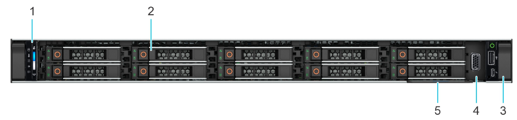
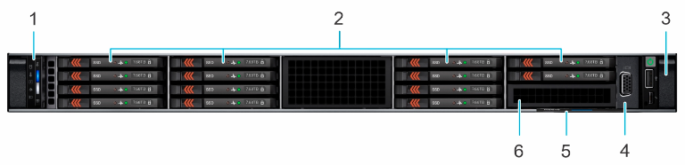
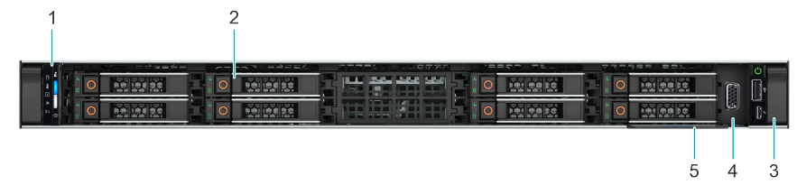
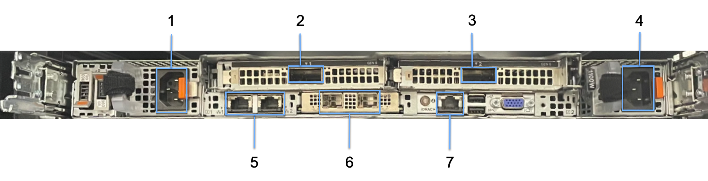
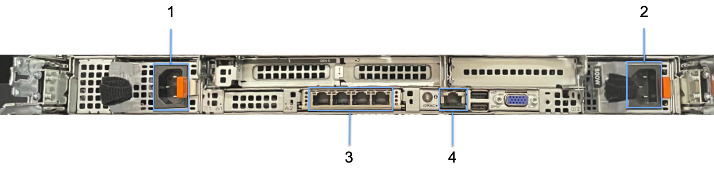
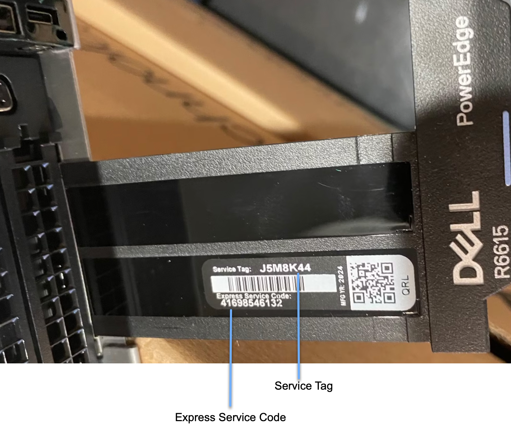
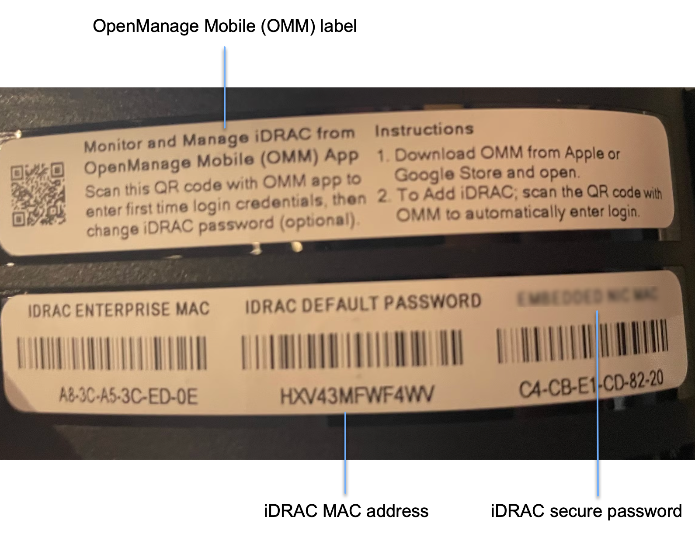

# WEKApod servers overview

## **WEKApod server core** component

The WEKApod's core component is a 1U server that includes:

* **Processor:** One AMD EPYC 9454P 48-Core Processor.
* **Memory:** 12 DDR5 DIMM slots with 384 GB.
* **Power supply:** Two redundant AC power units.
* **NVMe drive options:** (order-dependent)
  * 10 x 2.5-inch NVMe drives (WEKApod Prime)
  * 14 x E3.S NVMe drives (WEKApod Nitro)
  * 8 x 2.5-inch NVMe drives (WMS)
* **High-speed storage connectivity:** InfiniBand cards (order-dependent):
  * NVIDIA CX-6 MCX653105A-HDAT (WEKApod Prime)
  * NVIDIA CX-7 MCX75310AAS-NEAT (WEKApod Nitro)
  * NVIDIA CX-7 MCX75210AAS-NEAT (WEKApod Nitro)
* **Networking:** Network Interface Card (NIC) for general-purpose networking.


A WEKApod server installed with WSA is referred to as a **WSA server**.

A WEKApod server installed with WMS is referred to as a **WMS server**.


## Front view of the WEKApod servers

The front view of the WEKApod server configuration is order-dependent:

* WEKApod Prime: A WSA server equipped with 10 X 2.5-inch NVMe drives.
* WEKApod Nitro: A WSA server equipped with 14 X E3.S NVMe drives.
* WMS: A WMS server equipped with 8 X 2.5-inch NVMe drives.

<figure><figcaption>
Front view of the WSA server Prime (10 X 2.5-inch NVMe drives)
</figcaption></figure>

<figure><figcaption>
Front view of the WSA server Nitro (14 E3.S NVMe drives)
</figcaption></figure>

<figure><figcaption>
Front view of the WMS server (8 X 2.5-inch NVMe drives)
</figcaption></figure>

**Front view of the WSA and WMS servers: Ports, panels, and slots descriptions** (all configurations)

| Item | Ports, panels, and slots | Description |
| --- | --- | --- |
| 1 | Left control panel | Contains the system health, system ID, and the status LED indicators. |
| 2 | Drives | Enables you to install NVMe drives supported on your system (order-dependent: E3.S or 2.5-inch). |
| 3 | Right control panel | Contains the power button with integrated power LED, 1 x VGA port, 1 x 2.0 USB port, iDRAC Direct (Micro-AB USB) port, and the iDRAC Direct status LED. |
| 4 | VGA | Enables you to connect a display device to the system. |
| 5 | Information tag | The Express Service Tag is a slide-out label panel that contains system information such as Service Tag, NIC, MAC address, and so on. If you have opted for the secure default access to iDRAC, the Information tag also contains the iDRAC secure default password. |
| 6 | E3.S blank | Enables you to install blanks for 14 x E3.S configuration. |

## Rear view of the WSA and WMS servers

<figure><figcaption>
Rear view of the WSA server
</figcaption></figure>

**Rear view of the WEKApod server: Ports, panels, and slots**

| Item | Ports, panels, and slots | Description |
| --- | --- | --- |
| 1 | Power supply unit (PSU1) | Primary power supply unit. |
| 2 | InfiniBand port 1 | 400 Gbps HDR InfiniBand port (**ib1**) for storage network connectivity. |
| 3 | InfiniBand port 2 | 400 Gbps HDR InfiniBand port (**ib0**) for storage network connectivity. |
| 4 | Power supply unit (PSU2) | Secondary power supply unit. |
| 5 | OS management Ethernet ports | 1 Gbps Ethernet ports (left to right): WEKA Linux **eno8303** and **eno8403**. |
| 6 | 25 Gbps Ethernet ports | Extra 25 Gbps Ethernet ports for auxiliary uses like WEKA Object Storage tiering, Snapshot-to-Object backup, and other secondary applications. |
| 7 | BMC Ethernet port | Ethernet port for in-band management (iDRAC). |

**Rear view of the WMS server: Ports, panels, and slots**

<figure><figcaption>
Rear view of the WMS server
</figcaption></figure>

| Item | Ports, panels, and slots | Description |
| --- | --- | --- |
| 1 | Power supply unit (PSU1) | Primary power supply unit. |
| 2 | Power supply unit (PSU2) | Secondary power supply unit. |
| 3 | OS management Ethernet ports | 1 Gbps Ethernet ports (left to right): WEKA Linux **eno12399**, **eno12409**, **eno12419**, and **eno12429**. |
| 4 | BMC Ethernet port | Ethernet port for in-band management (iDRAC). |

## Server Information tag location

Each server can be identified by its unique Express Service Code and Service Tag. To access this information, pull out the Information tag located at the front of the server. Alternatively, this information may be found on a sticker on the chassis. The mini Enterprise Service Tag (EST) is located on the back of the server and is used to route support calls to the appropriate personnel.

A spreadsheet containing the corresponding Service Tag number provides details on the WEKApod server's IP address and mount order.

The Information tag is a slide-out label that displays key server details, including the Service Tag, NIC, MAC address, and more. It also includes the iDRAC secure default password; however, note that the password has been reset to **WekaService** through the ID Module.

<figure><figcaption>
Information tag upper view (pulled from the front-right of the server)
</figcaption></figure>

<figure><figcaption>
Information tag bottom view
</figcaption></figure>

