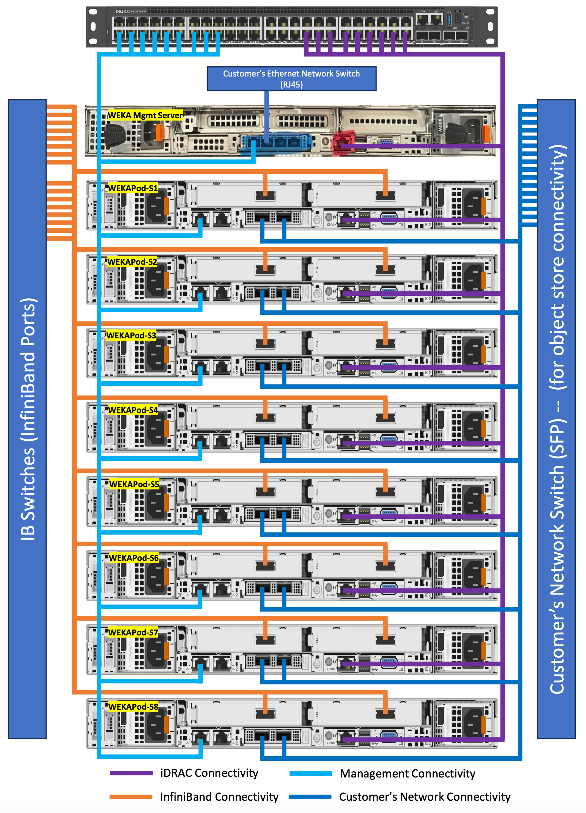
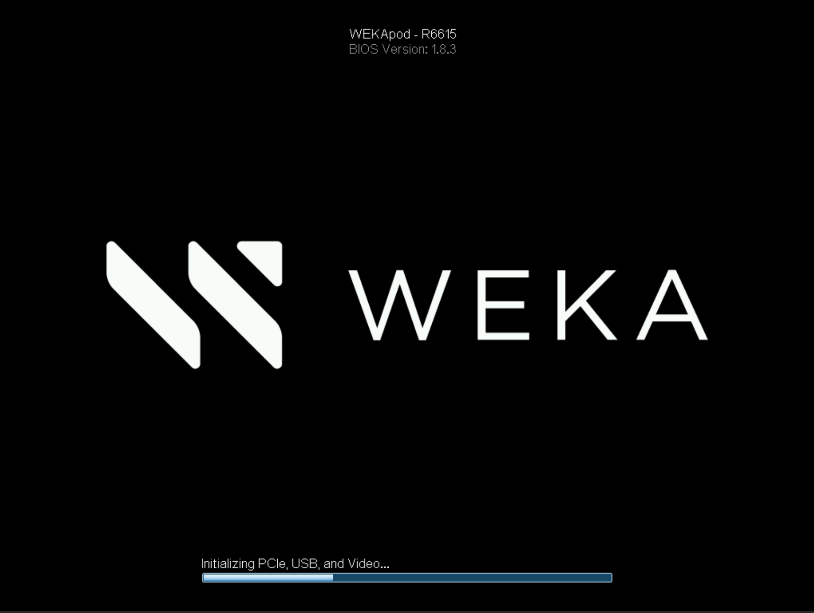
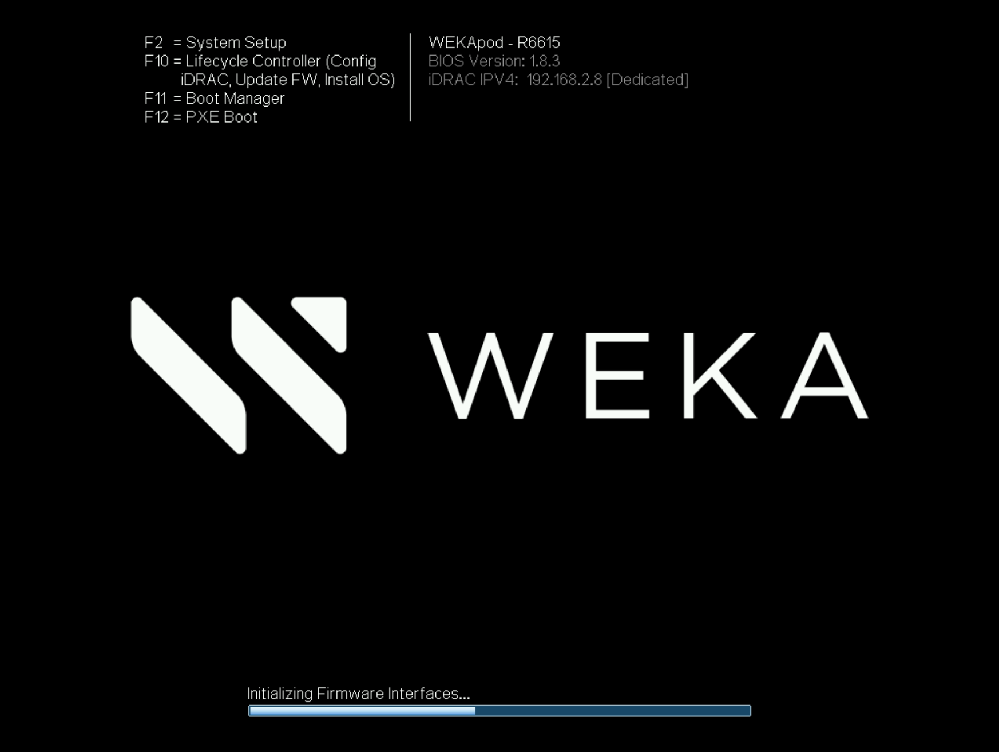
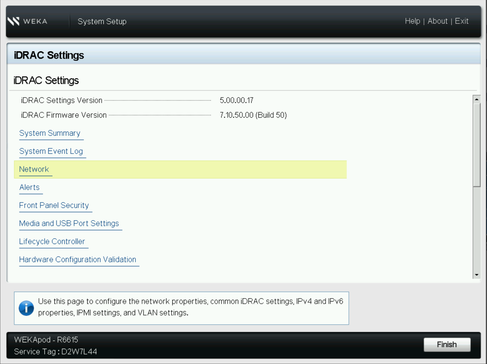
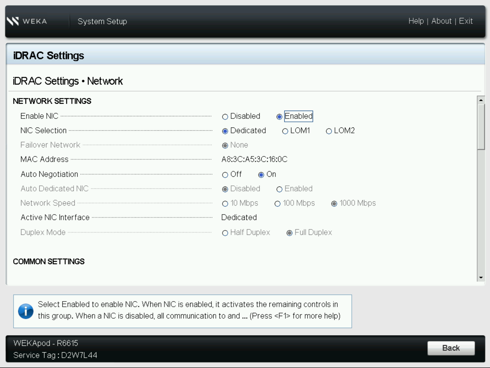
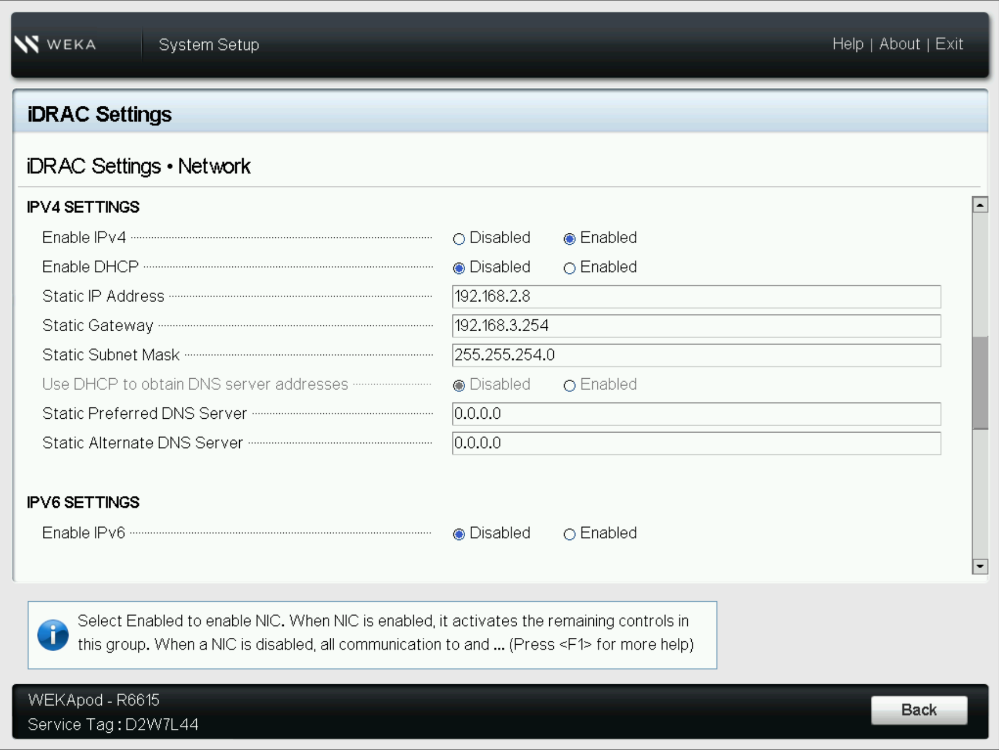
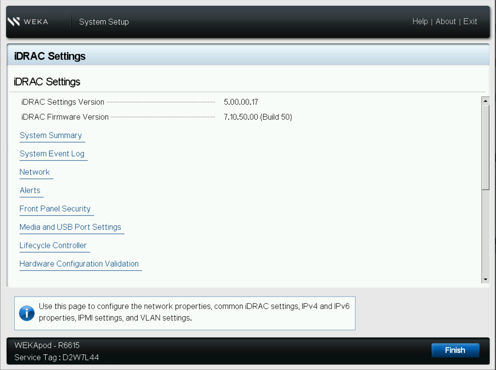

---
metaLinks:
  alternates:
    - https://app.gitbook.com/s/0yXyIrnroN3zIG3qa4W3/wekapod/setup
---

# WEKApod initial system setup and configuration

Complete the initial WEKApod hardware setup, then continue with the supported bare metal installation workflow.

## Workflow

1. [Prepare for installation](setup.md#prepare-for-installation)
2. [Install hardware](setup.md#install-hardware)
3. [Connect cables](setup.md#connect-cables)
4. [Configure the iDRAC](setup.md#configure-the-idrac)
5. [Install and configure the WEKA software](setup.md#install-and-configure-the-weka-software)

### Before you begin

Ensure the site is ready for deployment and that you have the rack plan, service tags, and network details for all servers.

### Prepare for installation

Ensure the customer site is ready for deployment according to the site requirements outlined during the service personnel's site survey.

A detailed site requirements document will be provided before installation, which includes, but is not limited to, the following:

* **Power**: Estimated consumption (for an 8-server setup, approximately 7,712 watts).
* **Cooling**: Required capacity (for an 8-server setup, approximately 30,027.2 BTU/hour).
* **Space**: Rack dimensions and required space (one server requires 1 rack unit with a maximum depth of 787 mm).

### Install hardware


**Heavy load:** Use proper lifting techniques, and seek help if the load is too heavy or awkward. Consider using lifting equipment if necessary.


1. **Rack preparation:** Confirm that the rack is securely mounted according to the rack installation guidelines.
2. **Device mounting:** Mount the following devices according to the rack installation guidelines:
   * **Ethernet switch:** Mount on the top rail of the rack.
   * **WEKApod servers:** Mount on the rails below the Ethernet switch in the order specified in the provided spreadsheet.\
     Match each server's service tag, which is available on the front panel and on the box, to the corresponding entry in the spreadsheet.

**Related topic**

[rack-installation.md](rack-installation.md "mention")

### Connect cables

1. Connect the peripherals to the system as follows:
   * **OS management:**
     * Connect the NIC port of each WEKApod server to the 1 Gbps Ethernet switch (if the switch is not available, connect to the customer's Ethernet network).
   * **BMC/iDRAC/iLO/IPMI:** Connect the BMC Ethernet port of each WEKApod server to the 1 Gbps Ethernet switch.
   * **InfiniBand (IB):** Connect the two IB ports of each WEKApod server to the IB network.
   * **25 Gbps Ethernet:** Connect the two OPC NIC ports of each WEKApod server to the customer's network, enabling tiering to object store.
2. Connect the system to the electrical outlet.
3. Power on the system.

<figure><figcaption>
Connections diagram example of a WEKApod cluster with 8 servers
</figcaption></figure>

### Configure the iDRAC

iDRAC (Integrated Dell Remote Access Controller) is a proprietary technology developed by Dell. It provides remote management capabilities for Dell servers, allowing administrators to manage and monitor the server hardware independently of the operating system.

If the BMC interfaces are not already configured, perform this procedure for each WEKApod server.


The pre-configured IP address of the iDRAC/BMC interfaces of the backend servers is **192.168.2.x**, as indicated in the provided spreadsheet and Packing List included with the shipment.


**Repeat this procedure for all WEKApod servers:**

1. Connect a crash cart (KVM) to the server.
2. Power on or reboot the server.

<figure><figcaption></figcaption></figure>

3. Press **F2** when prompted to enter the **System Setup**.


Alternatively, you can configure these settings using the **Lifecycle Controller** (press **F10** during boot).


<figure><figcaption></figcaption></figure>

4. Navigate to **Network** settings.

<figure><figcaption></figcaption></figure>

5. In **NETWORK SETTINGS**, ensure the NIC is enabled.

<figure><figcaption></figcaption></figure>

6. Scroll to the **IPV4 SETTINGS** section and configure the settings as shown in the following example according to your environment. If necessary, configure the settings in the additional sections.

<figure><figcaption></figcaption></figure>

7. Select **Finish** and exit the System Setup.

<figure><figcaption></figcaption></figure>

### Install and configure the WEKA software

Use the supported bare metal workflow to install and configure WEKA on WEKApod servers.

#### Configuration tips and troubleshooting

* **Installation troubleshooting**: If the installation halts without error messages, access the system console and review the logs located in the `/tmp/` directory. The primary log file is `/tmp/ks-pre.log`.
* **Accessing logs**: To open a command prompt from the installation GUI for log review:
  * On macOS, press `Ctrl+Option+F2`
  * On Windows, press `Ctrl+Alt+F2`
* **BMC access**: In some cases, you may need to use the Baseboard Management Controller (BMC) virtual console to complete the configuration.
* **Best practice**: Run the `dnf update` command on all WEKApod servers. Applying necessary security patches before configuration is essential for system security.

#### Procedure

1. [Download WEKA packages](../planning-and-installation/bare-metal/obtaining-the-weka-install-file.md).
2. [Install OS and WEKA software](../planning-and-installation/bare-metal/manually-install-os-and-weka-on-servers/).
3. [Prepare servers](../planning-and-installation/bare-metal/setting-up-the-hosts/).
4. [Run WEKA Configurator](../planning-and-installation/bare-metal/configure-the-weka-cluster-using-the-weka-configurator.md).
5. [Complete post-configuration](../planning-and-installation/bare-metal/perform-post-configuration-procedures.md).

## Next steps

After configuring the WEKApod servers, start managing the system using the GUI, CLI, or REST API, and add clients to your WEKA cluster.

**Related topics**

[Get Started with NeuralMesh](https://app.gitbook.com/s/ZW262oqYA8pNNfGvXjHa/getting-started-with-weka "mention")

[adding-clients-bare-metal.md](../planning-and-installation/bare-metal/adding-clients-bare-metal.md "mention")
