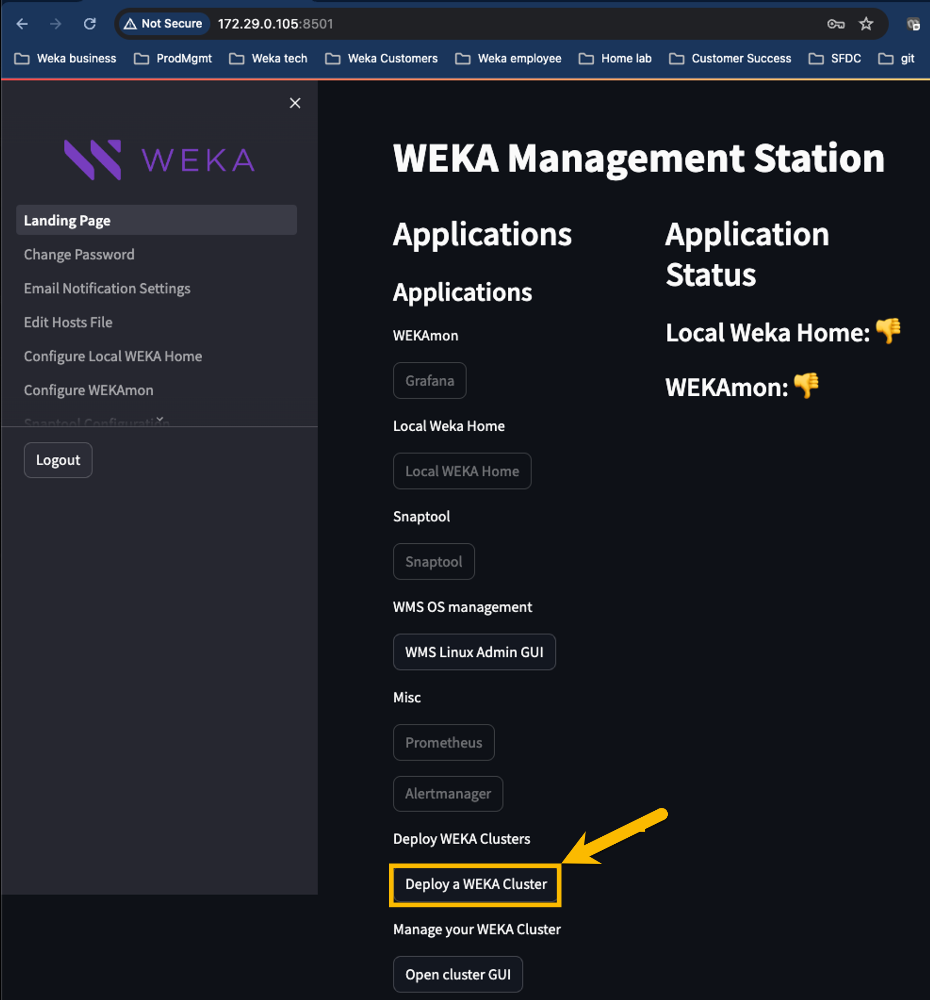

# WEKApod initial system setup and configuration

## Workflow

Follow these procedures to complete the installation, initial setup, and configuration for the WEKApod system.

1. [#prepare-for-installation](wekapod-initial-system-setup-and-configuration.md#prepare-for-installation "mention")
2. [#install-hardware](wekapod-initial-system-setup-and-configuration.md#install-hardware "mention")
3. [#connect-cables](wekapod-initial-system-setup-and-configuration.md#connect-cables "mention")
4. [#configure-the-idrac](wekapod-initial-system-setup-and-configuration.md#configure-the-idrac "mention") (if the WMS server and Ethernet switch are unavailable)
5. [#configure-the-weka-software-using-wms](wekapod-initial-system-setup-and-configuration.md#configure-the-weka-software-using-wms "mention")

### Prepare for installation

Ensure the customer site is ready for deployment according to the site requirements outlined during the service personnel's site survey.

A detailed site requirements document will be provided before installation, which includes, but is not limited to, the following:

* **Power**: Estimated consumption (for an 8-server setup, approximately 7,712 watts).
* **Cooling**: Required capacity (for an 8-server setup, approximately 30,027.2 BTU/hour).
* **Space**: Rack dimensions and required space (one server requires 1 rack unit with a maximum depth of 787 mm).

### Install hardware


**Heavy load:** Use proper lifting techniques, and seek help if the load is too heavy or awkward. Consider using lifting equipment if necessary.


1. **Rack preparation:** Confirm that the rack is securely mounted according to the rack installation guidelines.
2. **Device mounting:** Mount the following devices according to the rack installation guidelines:
   * **Ethernet switch:** Mount on the top rail of the rack.
   * **WMS server:** Mount on the rail directly below the Ethernet switch.
   * **WEKApod servers:** Mount on the rails below the WMS server in the order specified in the provided spreadsheet.\
     Match each server's service tag, which is available on the front panel and on the box, to the corresponding entry in the spreadsheet.

**Related topic**

[rack-installation.md](rack-installation.md "mention")

### Connect cables

1. Connect the peripherals to the system as follows:
   * **OS management:**
     * Connect the first WMS Ethernet port to the 1 Gbps Ethernet switch (if the switch is not available, connect to the customer's Ethernet network).
     * Connect the second WMS Ethernet port to the customer's Ethernet network.
     * Connect the NIC port of each WEKApod server to the 1 Gbps Ethernet switch (if the switch is not available, connect to the customer's Ethernet network).
   * **BMC/iDRAC/iLO/IPMI:** Connect the BMC Ethernet port of each WEKApod server to the 1 Gbps Ethernet switch.
   * **InfiniBand (IB):** Connect the two IB ports of each WEKApod server to the IB network.
   * **25 Gbps Ethernet:** Connect the two OPC NIC ports of each WEKApod server to the customer's network, enabling tiering to object store.
2. Connect the system to the electrical outlet.
3. Power on the system.

<figure><figcaption>
Connections diagram example of a WEKApod cluster with 8 servers
</figcaption></figure>

### Configure the iDRAC

iDRAC (Integrated Dell Remote Access Controller) is a proprietary technology developed by Dell. It provides remote management capabilities for Dell servers, allowing administrators to manage and monitor the server hardware independently of the operating system.

When the WEKApod system is shipped with a WMS server and Ethernet switch, the WSA servers come pre-configured with IP address information. Therefore, perform this procedure only if the **WMS server and Ethernet switch are unavailable**; otherwise, skip this step.


The pre-configured IP address of the iDRAC/BMC interfaces of the backend servers is **192.168.2.x**, as indicated in the provided spreadsheet and Packing List included with the shipment.


**Repeat this procedure for all WSA servers:**

1. Connect a crash cart (KVM) to the server.
2. Power on or reboot the server.

<figure><figcaption></figcaption></figure>

3. Press **F2** when prompted to enter the **System Setup**.


Alternatively, you can configure these settings using the **Lifecycle Controller** (press **F10** during boot).


<figure><figcaption></figcaption></figure>

4. Navigate to **Network** settings.

<figure><figcaption></figcaption></figure>

5. In **NETWORK SETTINGS**, ensure the NIC is enabled.

<figure><figcaption></figcaption></figure>

6. Scroll to the **IPV4 SETTINGS** section and configure the settings as shown in the following example according to your environment. If necessary, configure the settings in the additional sections.

<figure><figcaption></figcaption></figure>

7. Select **Finish** and exit the System Setup.

<figure><figcaption></figcaption></figure>

### Configure the WEKA software using WMS

For WEKApod systems that include a WMS server and Ethernet switch, follow the steps below to configure the software using the WMS.

If your WEKApod system does not include a WMS server and Ethernet switch, refer to the instructions for reinstalling the operating system, WEKA software, and configuring the system. See .

#### Configuration tips and troubleshooting

* **Installation troubleshooting**: If the installation halts without error messages, access the system console and review the logs located in the `/tmp/` directory. The primary log file is `/tmp/ks-pre.log`.
* **Accessing logs**: To open a command prompt from the installation GUI for log review:
  * On macOS, press `Ctrl+Option+F2`
  * On Windows, press `Ctrl+Alt+F2`
* **BMC access**: In some cases, you may need to use the Baseboard Management Controller (BMC) virtual console to complete the configuration.
* **Best practice**: Run the `dnf update` command on all WEKApod servers and the WMS. Applying necessary security patches before configuration is essential for system security.

#### **Procedure**

1. Log in on the console or through SSH as the weka user (root password: `WekaService`; weka user password: `weka.io123`).
2. Browse the WMS Admin UI using the URL: `http://<WMS-hostname-or-ip>:8501`.

<figure><figcaption></figcaption></figure>

3. Enter username and password (default: _admin_/_admin_), and select **Login**. The Landing Page appears.
4. Select **Deploy a WEKA Cluster** and ensure any popup blockers are disabled.

<figure><figcaption></figcaption></figure>

5. Select **WEKApod Install**.
6. In Step 1 - Number of servers, the default is set to 8. If your deployment requires a different number, adjust this value as needed, then click **Next**.

<figure><figcaption></figcaption></figure>

7. In Step 2 - Verify IPMI Connectivity, the WMS automatically fills in the IPMI IPs. Ensure the IPMI/iDRAC first IP, username, and password are correct (default: root/WekaService). Click **Verify IPMI IPs** and confirm that the **Brand** column shows Dell. Then, click **Next**.

<figure><figcaption></figcaption></figure>

8. In Step 3 - Dataplane Settings, enter the required IP information for the Dataplane network, then click **Update Dataplanes**.

<figure><figcaption></figcaption></figure>

9. Ensure the Dataplanes are configured correctly, then click **Next**.

<figure><figcaption></figcaption></figure>

10. In Step 4 - Save Files and Run Validation Checks, click **Save Files and Run Validation Checks**.

<figure><figcaption></figcaption></figure>

11. Confirm that all settings are correct. Click **Download Configuration CSV File** to save the configuration, then click **Next**.

<figure><figcaption></figcaption></figure>

12. In Step 5 - Optional (Re)install WEKA Software, you can update the WEKA version if needed (the current version may be outdated based on the WSA version used to image the servers).\
    If you do not want to update the WEKA version, click **Next/Skip**.\
    \
    To update the WEKA version:
    1. Place the required WEKA version in the weka user's home directory (`~/weka`) on the WSA server.
    2. Click **Refresh Weka Software File List**.
    3. Select the new version from the list.
    4. Click **Start WEKA Software Install**. This process may take a few minutes.
    5. Once the installation is complete, click **Next/Skip**.

<figure><figcaption></figcaption></figure>

13. In Step 6 - Apply OS and Dataplane Settings, click **Run Post-Install Scripts**. This process typically takes 3-5 minutes for an 8-server cluster, but larger clusters take longer.

<figure><figcaption></figcaption></figure>

14. Upon completion of the preceding steps, proceed with the standard configuration of the cluster as outlined in [configure-the-weka-cluster-using-the-weka-configurator.md](../planning-and-installation/bare-metal/configure-the-weka-cluster-using-the-weka-configurator.md "mention").

## Next steps

After configuring the WEKApod servers, start managing the system using the GUI, CLI, or REST API, and add clients to your WEKA cluster.

**Related topics**

[Broken link](broken-reference "mention")

[adding-clients-bare-metal.md](../planning-and-installation/bare-metal/adding-clients-bare-metal.md "mention")
